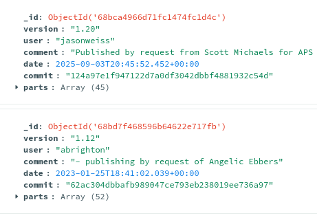
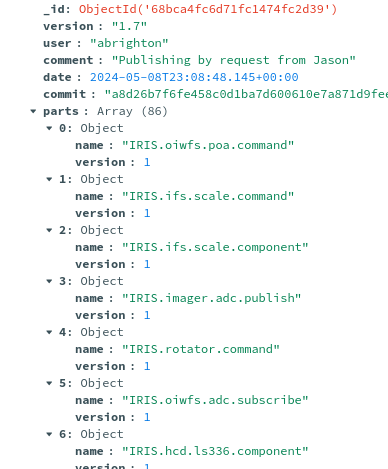

# For Developers / Maintainers

The following are some tips for developers / maintainers of the icd software.

## Building

To build the app, run install.sh.

* sbt stage - installs scripts for the apps under ./target/universal/stage/bin
* sbt makeSite - builds the documentation under target/site (not done by install.sh)

I'm not sure what the correct sbt command is to install the docs on GitHub.
I did it the manual way by checking out the tmtsoftware.github.io repo and copying in the 
contents of target/site/idbs.

The app depends on a number of external tools, such as cs and swagger-codegen.
The install.sh script checks this.

### ScalaJS Client Dependencies

The ScalaJS client side dependencies mostly come from [webjars](https://www.webjars.org/).
See `clientJsDeps` in [build.sbt](build.sbt).

The new sorting features in the web app summary tables is based on the [bootstrap-table](https://bootstrap-table.com/)
dependency. It depends on  more recent version of jquery that conflicted with the one 
used by [jquery-ui](https://jqueryui.com/), which was previously used to make the sidebar resizable.
I removed the jquery-ui dependency. The sidebar is no longer resizable, but has the correct size by default.

Some plain JavaScript code can also be included under [icd-web-client/src/main/resources](icd-web-client/src/main/resources)
for cases where it is difficult to implement in ScalaJS.

## Play Framework App

The icd web server is a Play Framework app on the server side with ScalaJS on the client side.
One good way to test the server during development is to start `sbt` and at the prompt, type:

    ~icdWebServer/run

This runs the Play server and automatically compiles changes. In some cases you made need to hit Return to
make it compile some changes. You probably also need to refresh the browser page then.

You can also debug the server with Intellij Idea. Just create a new Play Framework debug configuration.

### Server is actor based to handle concurrency, client uses ScalaJS

The entrance point to the icd server is [routes](icd-web-server/conf/routes) (Note: The client side routes are in
[ClientRoutes](icd-web-client/src/main/scala/icd/web/client/ClientRoutes.scala)).
From there it calls methods in the [Application](icd-web-server/app/controllers/Application.scala) controller,
which sends a message to the [application actor](icd-web-server/app/controllers/ApplicationActor.scala),
which finally calls the method in the [application implementation](icd-web-server/app/controllers/ApplicationImpl.scala).

The main class on the client side is [IcdWebClient](icd-web-client/src/main/scala/icd/web/client/IcdWebClient.scala).
It is called from the Play template [index.scala.html](icd-web-server/app/views/index.scala.html).
The other Play template file [main.scala.html](icd-web-server/app/views/main.scala.html) is used ike an
index.html file to import CSS and JavaScript code and create the main HTML page for the app.
The `csrfToken` is needed for web security reasons.

## Core icd Database classes

The icd database is based on MongoDB and the data is organized in collections that contain basically the contents of
the icd model files. 

Note: The [MongoDB Compass App](https://www.mongodb.com/products/tools/compass) is handy for examining the contents of the
icd database. The name of the database is `icds4`. If you ever want to force user's databases to be rebuilt, you can release
a new version of idea with a new database name, like icds5.

The main core classes are [IcdDb](icd-db/src/main/scala/csw/services/icd/db/IcdDb.scala) and
[IcdGit](IcdGit).
IcdDb and [IcdDbQuery](icd-db/src/main/scala/csw/services/icd/db/IcdDbQuery.scala) handle the basic MongoDB operations.
[IcdVersionManager](icd-db/src/main/scala/csw/services/icd/db/IcdVersionManager.scala) handles
access to versions of an API.
[IcdGitManager](icd-db/src/main/scala/csw/services/icd/github/IcdGitManager.scala) manages access to the published versions
of the APIs and ICDs on GitHub.

## Validation

When icd model files are ingested into the database, they are validated, first with JSON Schema
(See [icd-db/src/main/resources/4.0](icd-db/src/main/resources/4.0)).
Then, after the files are ingested into MongoDB collections, 
[post-ingest validations](icd-db/src/main/scala/csw/services/icd/db/PostIngestValidation.scala) are made.
You can always add methods there to check things.

Note: The icd model files are ingested first into temporary collections ($name.tmp), which are deleted in case
of JSON-Schema validation errors. Also, backup copies of the collections are made, and later restored if the post-ingest 
validation fails.

## Versioning

There are two levels of versioning. 

* Subsystem API versions, like 1.1, 1.2
* Low level, model `part` versions (1, 2, 3)

The subsystem API versions are managed in collections named after the subsystem with a `v` suffix: For example: TCS.v.

In the collection TCS.v there is an entry for each version that contains the version name, user, comment, date and git commit SHA
as well as a list of `parts`, which map to the original icd model files.

For example version "1.1" of an API might consist of version 1 of the event-model and version 3 of the command-model. In the image below, the version just happens to always be 1. 

For each new version, the parts are compared to the previous version's parts. If they are the same, they share the same part version. If they are different, a new part entry is made with an incremented version number.
So two API versions might share most of the parts, if for example, only events in one HCD were added.

### Pseudo versions: master and uploaded

In addition to the normal API versions (1.1, 1.2, etc.) there are two pseudo versions added to the collection: `master`, for the master branch, and `uploaded` for locally uploaded API model files. When the `master` version is selected, the git SHA is compared to the latest one from GitHub 
and the new version is automatically ingested into the database as needed.

### Working versions

Model files are always first ingested into the working area: These are collections with names like IRIS.csro.command, IRIS.drs.publish.
Then they are *published* internally, by inserting them into a collection with the `v` suffix. For example,
IRIS.csro.command.v, IRIS.drs.publish.v.

The working version (which used to show up in the UI as "*") normally contains the most recently published version or uploaded version.
This is no longer displayed in the GUI, however if you select the options to display client data and search other subsystems in an API
(this includes subscribed items and sent commands in the API display), then the working versions are used for this search.
This is not enabled by default. You have to click the two checkboxes in the web app to enable it.

## Web app display vs. PDF

The HTML displayed in the web app is different from that used to generate the PDFs, since it contains
interactive JavaScript parts.

The main class for generating the web app display for an API is [Components](icd-web-client/src/main/scala/icd/web/client/Components.scala),
while the main class for generating the HTML (which is used to generate the PDF) is [IcdToHtml](icd-db/src/main/scala/csw/services/icd/html/IcdToHtml.scala).
The class used to generate the summary tables can be shared in Scala and ScalaJS: [SummaryTable](icd-web-shared/src/main/scala/icd/web/shared/SummaryTable.scala).
Fortunately, the table sorting features are triggered by Bootstrap HTML attributes that are ignored in the non-JavaScript HTML/PDF version.
Both server and client side use the [scalatags](https://github.com/com-lihaoyi/scalatags) library to generate HTML, however
the server side uses `scalatags.Text` while the client side uses `scalatags.JsDom`.

## Performance Issues

One operation that is performed quite often is to check if a MongoDB collection exists.
As far as I know, the only way to do that is to get a list of all MongoDB collections and check if it is in the list.
Unfortunately, `getAllCollections()` in [IcdDbQuery](icd-db/src/main/scala/csw/services/icd/db/IcdDbQuery.scala) is a rather
slow operation. That is why I added [CachedIcdDbQuery](icd-db/src/main/scala/csw/services/icd/db/CachedIcdDbQuery.scala).
However, it is not always used. You can only use the cached version in read-only mode, otherwise changes would not be reflected.

Also, the code is mostly waits for async operations. At one point I tried to make things run in parallel to improve performance,
but it got too complicated, with the external database.

