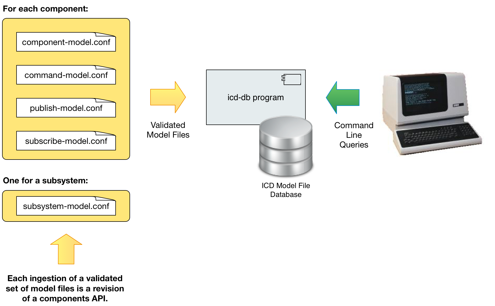

# Using the icd-db command line app

The `icd-db` program can be used to validate and ingest model files into the database. In order to use the `icd-db` program, the MongoDB server must be running (see @ref[Installing MongoDB](../installing/installing.md#installing-mongodb)). Most of what `icd-db` command provides can also be done using the web interface, so it’s possible to skip this step.



The figure above shows the usage of the `icd-db` program. Its primary purpose is to validate and ingest model files into the ICD Model File Database. If any of the model files under the given directory don’t pass validation, then nothing is changed in the database. Error messages indicate where the validation errors occurred, including a file name and a position in JSONPath format.

Below you see the options for the `icd-db` command, which are listed with the --help option. Some of the options are basic querying of the database, to see what subsystems and components are currently in the local database, and information about them, such as data rates and units used. This can be useful when developing and browsing APIs without bringing up the full system.

```
icd-db 3.0.0
Usage: icd-db [options]

  --db <name>              The name of the database to use (default: icds4)
  -h, --host <hostname>    The host name where the database is running (default: localhost)
  -p, --port <number>      The port number to use for the database (default: 27017)
  -i, --ingest <dir>       Top level directory containing files to ingest into the database
  -l, --list [subsystems|assemblies|hcds|all]
                           Prints a list of ICD subsystems, assemblies, HCDs or all components
  --listData <subsystem>   Prints a list of event sizes and yearly accumulation of archived data for 
			   components of the specified subsystem.
  -u, --allUnits           Prints the set of unique units used in all received commands and published events 
			   for all components in DB.
  -c, --component <name>   Specifies the component to be used by any following options 
			   (subsystem must also be specified)
  -s, --subsystem <subsystem>[:version]
                           Specifies the subsystem (and optional version) to be used by any following options
  -t, --subsystem2 <subsystem>[:version]
                           Specifies the second subsystem (and optional version) in an ICD to be used by 
			   any following options
  --component2 <name>      Specifies the subsytem2 component to be used by any following options 
			   (subsystem2 must also be specified)
  --icdversion <icd-version>
                           Specifies the version to be used by any following options (overrides subsystem 
			   and subsystem2 versions)
  -o, --out <outputFile>   Saves the selected API (or ICD) to the given file in a format based on the file's
 			   suffix (html, pdf) or generates code for the given API in a language based on the
 			   suffix ('scala', 'java', 'ts' (typescript), py (python))
  --drop [db|subsystem|component]
                           Drops the specified component, subsystem, or the entire icd database 
			   (requires restart of icd web app)
  --versions <subsystem>   List the version history of the given subsystem
  --diff <subsystem>:<version1>[,version2]
                           For the given subsystem, list the differences between <version1> and <version2> 
			   (or the current version)
  -m, --missing <outputFile>
                           Generates a 'Missing Items' report to the given file (dir for csv) in a format 
			   based on the file's suffix (html, pdf, otherwise text/csv formatted files are
 			   generated in given dir)
  -a, --archived <outputFile>
                           Generates an 'Archived Items' report for all subsystems (or the given one) to the
 			   given file in a format based on the file's suffix (html, pdf, csv)
  --allSubsystems          Include all subsystems in searches for publishers, subscribers, etc. while 
			   generating API doc (Default: only consider the one subsystem)
  --clientApi              Include subscribed events and sent commands in the API dic (Default: only include
			   published events and received commands)
  --orientation [portrait|landscape]
                           For PDF output: The page orientation (default: landscape)
  --fontSize <size>        For PDF or HTML file output: The base font size in px for body text (default: 10)
  --lineHeight <height>    For PDF or HTML file output: The line height (default: 1.6)
  --paperSize [Letter|Legal|A4|A3]
                           For PDF output: The paper size (default: Letter)
  --documentNumber text    For PDF output: An optional document number to display after the title/subtitle
  --package package.name   Package name for generated Scala files (default: no package)
  --help
  --version
```

Some example commands are shown below.

To ingest the directory of model files created in the last section use the `-i` or `--ingest` option:

    icd-db --ingest directoryName

The `–l` or `--list` option with a value of `subsystems`, `assemblies`, `HCDs`, or `all` will list the components in the database that meet the criteria:

    $ icd-db –list all

To list just assemblies:

    $ icd-db –list assemblies

List only HCDs:

    $ icd-db –list hcds

List the existing subsystems in the local database:

    $ icd-db –list subsystems

Several other commands are available and are not documented here.

## Generating Documents and Code from the ICD Database

The `icd-db –o` option can be used to output a file in a format based on the file’s suffix (`.pdf` and `.html` are supported for generating documentation and `.scala`, `.java`, `.py` (python) and `.ts` (typescript) are supported for generating code containing the event, command and parameter keys for the given subsystem and/or component:

    $ icd-db –s TCS -o TcsApi.pdf    // Generate a PDF for TCS
    $ icd-db –s TCS -o TcsApi.scala  // Generate Scala code for TCS
    $ icd-db –s TCS -o TcsApi.java   // Generate Java code for TCS
    $ icd-db –s TCS -o TcsApi.py     // Generate Python code for TCS
    $ icd-db –s TCS -o TcsApi.ts     // Generate Typescript code for TCS

You can also generate documentation and code for a specific component of a subsystem and specify the package name (required for Java):

```
$ icd-db –s IRIS -c ifs.scale -o IrisApi.pdf                     // Generate a PDF for IRIS.ifs.scale
$ icd-db –s IRIS -c ifs.scale –package iris.api -o IrisApi.scala // Generate Scala code for IRIS.ifs.scale
$ icd-db –s IRIS -c ifs.scale –package iris.api -o IrisApi.java  // Generate Java code for IRIS.ifs.scale
$ icd-db –s IRIS -c ifs.scale -o IrisApi.py                      // Generate Python code for IRIS.ifs.scale
$ icd-db –s IRIS -c ifs.scale -o IrisApi.ts                      // Generate Typescript code for IRIS.ifs.scale
```

The generated code always contains a top level object (scala), class (java, python) or namespace (typescript) with the base name of the file. Then there are nested objects for each component, and in each component, nested objects for each event and command, containing constants for all the event keys, command names and parameter keys.

@@@ note

After generating the code, `icd-db` attempts to format it using a command line formatter application in your shell path. It uses [scalafmt](https://scalameta.org/scalafmt/) for Scala, [prettier](https://prettier.io/) for TypeScript, [black](https://github.com/psf/black) for Python and [google-java-format](https://github.com/google/google-java-format) for Java. If it doesn't find those it will print a  message, but still generate the file. You can install scalafmt and `google-java-format` with [cs (coursier)](https://get-coursier.io/), `black` with `pip` (`pip3`), and `prettier` with [npm](https://www.npmjs.com/).

@@@

You can also generate code using the web interface, as described later.

