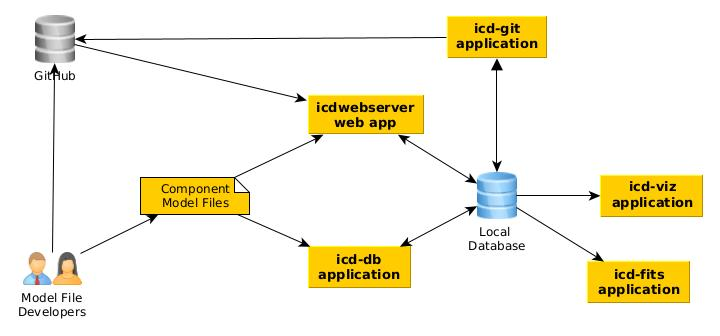
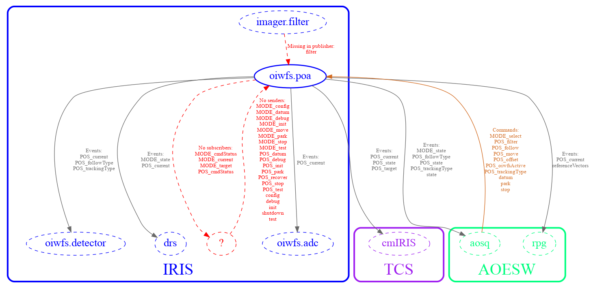

# Overview

The IDBS software currently consists of the following programs: 	

* icd-db
* icd-git
* icd-viz
* icd-fits
* icdwebserver

The components of the Interface Database System are shown below.
They are briefly described here, with more details provided in subsequent sections.

The workflow proceeds from left to right.



The TIO developer, using Common Software for his/her components, creates component model files. These files are validated and ingested into the ICD Model File Database using either the `icd-db` command or a web application called `icdwebserver`. These were developed to work with the ICD Model File Database and provide the functionality the users of the system need. The model files are stored and published in Git repositories on GitHub. The `icd-git` application can be used to sync the local database with the published versions on GitHub. The icd web app also gets its information from the published versions on GitHub, in addition to any unpublished (uploaded) versions that a developer is working with locally. The `icd-viz` command line application can be used to generate a graph of component or subsystem relationships. This feature requires that [graphviz](https://graphviz.org/) is installed and is also available in the icd web app. The `icd-fits` command can be used to view information about FITS keywords and their source events.

## icd-db

The `icd-db` program exists to validate and ingest model files into a local ICD Model File Database. When creating or modifying the models, this feature can be used to incorporate working versions of the files into the database system.  The `icd-db` program also allows some informative queries to be performed directly on the database, showing what subsystem and components exist in the database, and information about them such as data rates, data types, and units used.  Note that these operations only work on the models that exist in the local version of the database, and do not access the released models on the GitHub repository.

## icdwebserver

The `icdwebserver` web application provides the IDBS user application interface. The browser-based user interface allows the ingesting of model files, publishing them, and displaying versioned APIs for each component. An API is defined as all the functionality of a component or subsystem including inputs and outputs. An ICD is produced by taking the intersection of two subsystem API documents.

The IDBS browser provides the ability to browse the APIs for both published and unpublished models.  The published APIs are constructed from models obtained from the git repository which stores the released versions, and the unpublished APIs are constructed by accessing the models stored in the local database that have been ingested using the icd-db program or the web app.

The current version of the IDBS browser user interface includes the following features:

* Allows browsing all the subsystems and their components (including previously published versions as well as uploaded, unpublished working versions).
* View the API for a subsystem or an individual component.
* Browse interfaces between subsystems, or components within subsystems.
* Upload directories containing the model files for a subsystem API
* Publish APIs and ICDs (if enabled, for TIO SE use only)
* Print ICD or API information from the browser (using browser print).
* Export an API or ICD as a PDF document.
* Show the publish history of an API or ICD and compare the differences between versions
* Generate a PDF document that shows the amount of storage required for all archived events
* Generate a graph of component or subsystem relationships

A public (password-protected) ICD web service has been set up that allows users to view the APIs and ICDs of all TIO subsystems and components.  The uploading functionality of this web service has been disabled; new model files must be committed to the GitHub repository to add new versions to this system, which are automatically added to the web service whenever the system is refreshed. Log-in credentials can be obtained from Systems Engineering. This web service is located at: https://sdb.tmt.org/.

## icd-git

The icd-git application is a command line tool that can be used to update your local icd database with the published versions from GitHub (Use: `icd-git --ingest` to update the local database with the latest published versions, or `icd-git --ingestAll` to ingest all subsystem versions.). Otherwise, this application is primarily meant to be used by systems engineering to manage official releases of APIs and ICDs by interacting directly with versions of subsystem model files as maintained by the official GitHub repository (http://github.com/tmt-icd). Since this tool is mainly intended to be used by the Systems Engineering group, it is not documented here.

It is also possible to publish APIs and ICDs using the web app (`icdwebserver`) and this is now the preferred way to do it. The API publishing features of the web app are protected by password and only enabled for use by those with permission to push to the GitHub repository that holds that information.

## icd-viz

The `icd-viz` command line application generates a graph of the relationships of given components or subsystems. There are a number of options for controlling what is displayed and the format of the image produced. 

This application relies on [graphviz](https://graphviz.org/) to generate the graph from a description generated in the [dot](https://graphviz.org/doc/info/lang.html) graph description language. Run `icd-viz –help` to see the command line options (These are also listed in the [README.md](https://github.com/tmtsoftware/icd/blob/master/icd-viz/README.md) file for the `icd-viz` subproject on GitHub). Note that the icd web app also provides a user interface for most of these features. See @ref[Using the Web Interface](../webapp/webapp.md) for more information on that. 

The icd-viz command lets you specify one or more TIO components or subsystems (in which case all components in the subsystem are used). These are the primary nodes of the graph, drawn as solid ovals. Then, all of the components that publish events for these components or subscribe to events from these components are added to the graph (as dashed ovals). The graph edges indicate the flow of events and commands between the components and optionally show any errors, such as events subscribed from publishers that do not exist, or published events with no subscribers.

The default colors used for the graph can be found in [icd/icd-viz/src/main/resources/reference.conf](https://github.com/tmtsoftware/icd/blob/master/icd-viz/src/main/resources/reference.conf) and can also be overridden with a command line option like `-Dicd.viz.color.IRIS=darkgreen` (replace IRIS with the subsystem). The colors should be valid Graphviz colors.

@@@ note

The design of the icd-viz application is based on previous work ([NIC/scripts/icdRelationships.py](https://github.com/tmtsoftware/NIC/blob/master/script/icdRelationships.py)) from Ed Chapin of the NRC.

@@@

Example icd-viz command line usage:

Plot all interfaces for a particular component to the screen, label events and commands, and show missing events and commands:

```
icd-viz --components iris.oiwfs.poa --missingcommands true --missingevents true --commandlabels true --eventlabels true
```

Below is the resulting image from the above command:



## icd-fits

The icd-fits command line application can be used to manually ingest FITS dictionary files into the icd database and produce tables in PDF and other format containing information about all the FITS keywords and the subsystem events that are the source of the keyword values. There are command line options that allow you to filter the list of keywords by source subsystem and component as well as by tag.  

The command can also be used to merge the FITS keyword definitions found in the publish model files with the current FITS dictionary stored in the icd database to produce a new FITS dictionary, where the keyword definitions in the publish model files override the ones previously in the FITS dictionary. This can be used to update the `FITS-Dictionary.json` file in the [tmt-icd](https://github.com/tmt-icd/) [DMS-Model-Files](https://github.com/tmt-icd/DMS-Model-Files) GitHub repository, which is loaded automatically whenever the DMS model files are ingested into the icd database.

The main source for the FITS dictionary files is in the `FITS-Dictionary` directory in the tmt-icd [DMS-Model-Files](https://github.com/tmt-icd/DMS-Model-Files) GitHub repository. One file there, `FITS-Dictionary.json`, lists information about the FITS keywords and related subsystem, component, event, and parameter. Another file, `FITS-Channels.conf`, lists the available channel names for FITS keywords that have multiple source events or parameters. The third file, `FITS-Tags.conf`, assigns tags to the keywords, such as `SL` (Seeing-Limited), `DL` (Diffraction-Limited), or the `WFOS`, `IRIS` or `MODHIS` instruments.

Some keywords can come from multiple sources or channels, such as imaging or IFS. This information is also included in the FITS Dictionary JSON file above. When you specify the FITS keyword in an event’s parameter description in `publish-model.conf`, in most cases it is enough to just list the keyword name with keyword = keyname. If the same FITS keyword has multiple different source events/parameters, it needs to be assigned a channel as well. For example: `channel = IFS`. The channel name needs to be one of the predefined names for that subsystem listed in [FITS-Channels.conf](https://github.com/tmt-icd/DMS-Model-Files/blob/master/FITS-Dictionary/FITS-Channels.conf).

For more details, see @ref[Using the icd-fits command line app](../icd-fits/icd-fits.md).

*Note that at the time of writing these files are still in development and may contain incorrect information.*

## Implementation Details

The IDBS is implemented in Scala, a JVM-based language (http://www.scala-lang.org). The web application is developed using Play (https://www.playframework.com). These are tools selected for OSW and CSW. The ICD information is stored in a document database called MongoDB (https://www.mongodb.org).

The code is available on GitHub at: https://github.com/tmtsoftware/icd.
