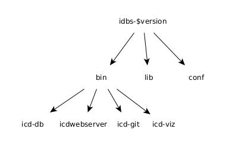

# Installing IDBS

While the public ICD web service can be useful for browsing existing APIs, it can be easier to develop model files by using the IDBS system locally.  The icd-db and icdwebserver programs are useful for the developer in order to validate and ingest model files into the local ICD database. The ICD software can be installed on any machine with a Java JDK version of 21 or greater. The details of installing Java on a system are not covered here (Java 21 was used for testing).

The following external applications are also required at runtime:
* [graphviz](https://graphviz.org/) – The `dot` command is required to generate graphs and for inline UML support.
* [swagger-codegen](https://swagger.io/docs/open-source-tools/swagger-codegen/) – Required for documenting HTTP services (at least version 3.0.36, install with `cs install --contrib swagger-codegen`)
* [mongodb](https://www.mongodb.com/docs/manual/core/transactions/) – Required for the database that stores the API information (see below)
* [jsonnet](https://jsonnet.org/) - Required to process model files written in the `jsonnet` language

The following applications are optional and used if present to fomat generated source code:
* [scalafmt](https://scalameta.org/scalafmt/docs/installation.html) - Used to format generated Scala source files (Install with `cs install scalafmt`)
* [google-java-format](https://github.com/google/google-java-format) - Used to format generated Java source files
* [black](https://github.com/psf/black) - Used to format generated Python source files
* [prettier](https://prettier.io/) - Used to format generated Typescript source files

## Installing the Binary Release

Binary releases of IDBS are available on GitHub at:

https://github.com/tmtsoftware/icd/releases

Please download the most recent release. The file is available as a zip file. It can be unpacked on Mac or Linux with:

    unzip idbs-$version.zip

where *$version* is the release version.

Once the installation is unpacked it creates a directory named `idbs-$version` that contains three subdirectories: `bin`, `conf`, and `lib`. Inside `bin` are the application scripts: `icd-db`, `icd-git`, `icd-viz`, `icd-fits` and `icdwebserver.

The image below shows the basic directory structure of the IDBS binary distribution downloaded from GitHub:

The `icd-db` or `icdwebserver` program is needed to validate and ingest the directories containing your model files. You might want to put the `idbs-$version/bin` directory in your shell path.

## Installing the Source Release

The source for the IDBS programs can be downloaded from the tmtsoftware GitHub repository with the command:

    git clone https://github.com/tmtsoftware/icd.git

The git clone command will result in a local directly called icd. An `install.sh` script is provided that builds and installs all the subprojects into a directory called `install_icd` in the parent directory of the download directory (the `../install_icd` directory). The `install_icd` directory contains the directories: `bin`, `conf`, and `lib`. Inside the `bin` directory are `Linux/Mac` friendly scripts to start the components of IDBS.

The code is built with the `sbt` build program, which must be downloaded and installed (see http://www.scala-sbt.org). That task is not covered here. The “All Platforms” or “Manual installation” is quick, which is the suggested approach.

The `icdwebserver` application starts the web application (by default on localhost:9000).

## Installing MongoDB

In order to run the icd applications locally, it is necessary to install the database MongoDB, which is available at https://www.mongodb.org. The community edition is sufficient for our needs and instructions for installation can be found for a variety of platforms at

https://docs.mongodb.com/manual/administration/install-community/.

Note that it may be necessary to adjust system limits in order for mongod to run correctly. See

https://docs.mongodb.com/manual/reference/ulimit/.

Note: If you wish to “start over” with no database entries, you can use the command `icd-db –drop db`. Run `icd-git –ingest` to get the published APIs and ICDs from the released versions on GitHub.

