# Model Files

In the OMOA, subsystem software consists of components: Hardware Control Daemons, Assemblies, Sequencers, and
Applications. Model files that provide information about the component and its interfaces are created for each of the
components. This section describes the model files. The model files are named: component-model, command-model,
publish-model, alarm-model, and subscribe-model. In addition, each subsystem has a single subsystem-model file and may
have one or more `$subsystem-icd-model` files that contain additional information about the interface between two
subsystems. Separate files were created (rather than one larger file) in order to keep the configuration files simpler
and easier to type.

The following table shows the different types of model files and what they describe:

| Model File | Description | 
|:----------|:------------| 
| subsystem-model.conf | Contains high-level information about the subsystem that contains a group of components. There is one subsystem-model.conf file per subsystem. | 
| component-model.conf | Contains high-level component information. There is one component-model.conf file per component. |
| command-model.conf | Describes the configuration commands the component supports. Also describes components and commands the component may send to other components. There is at most one command-model.conf file per component. |
| publish-model.conf | Describes events the component publishes using Event Services. There is at most one publish-model.conf file per component. |
| service-model.conf | Describes HTTP services provided or consumed by the component. The HTTP services themselves are described in OpenAPI files. |
| alarm-model.conf | Describes alarms the component publishes using the Alarm Service. There is at most one alarm-model.conf file per component. |
| subscribe-model.conf | Describes events the component subscribes to using Event Services. There is at most one subscribe-model.conf file per component. |
| *$subsystem*-icd-model.conf | Where *$subsystem* is the name of one of the other TMT subsystems, for example: IRIS-icd-model.conf. These files may contain additional information about the interface between the subsystem being defined and another subsystem (IRIS in this example). | 

The component is only required to create a `command-model.conf`, `publish-model.conf`, `alarm-model.conf`,
or `subscribe-model.conf` if it provides or uses the features described in the model files (i.e. if the component does
not subscribe to events, then a `subscribe-model.conf` file is not needed).

Model files are text files written in a superset of JSON
called [HOCON](https://github.com/typesafehub/config/blob/master/HOCON.md), which provides syntactic sugar for writing
JSON, but can be exported as pure JSON. In addition, most fields support GitHub style MarkDown as well as HTML tags.
LaTeX math markup and UML are also supported (see below). In addition, it is possible to reuse certain repetitive
definitions, such as those for events, commands and parameters by using the `ref` keyword in the model files to refer to
another definition. The syntax is described below. Each type of model file has a schema which specifies the allowed
structure of the contents within, including specifying the optional and required items, item types, allowed ranges, etc.
The following sections describe each of the model files including necessary fields.

## Markdown Support, Math, UML, Dot

In addition to using standard [GitHub style MarkDown](https://github.github.com/gfm/) in descriptions, you can also
insert LaTeX math formulas:
Here is an example description text containing an inline math formula:

```
description = """
Here is an example using LaTeX math: $`\frac{d}{dx}\left( \int_{0}^{x} f(u)\,du\right)=f(x)`$.
And here is another: $`[x^n + y^n = z^n]`$.
“””
```

And this is the inline math formula displayed from the above input:

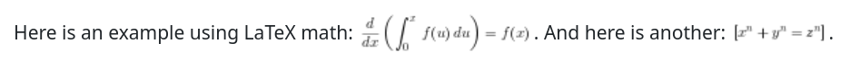

Block math formulas are delimited by

    ```math
    
    ``` 

For example:

    Description = “””
    Here is an example using LaTeX math: $`\frac{d}{dx}\left( \int_{0}^{x} f(u)\,du\right)=f(x)`$.
    And here is another: $`[x^n + y^n = z^n]`$.
    
    This is a math block:
    
    ```math
    $$\idotsint_V \mu(u_1,\dots,u_k) \,du_1 \dots du_k$$
    ```
    
    and another:
    
    ```math
    \frac{n!}{k!(n-k)!} = \binom{n}{k}
    ```
    
    and a matrix:
    
    ```math
    A_{m,n} =
     \begin{pmatrix}
      a_{1,1} & a_{1,2} & \cdots & a_{1,n} \\
      a_{2,1} & a_{2,2} & \cdots & a_{2,n} \\
      \vdots  & \vdots  & \ddots & \vdots  \\
      a_{m,1} & a_{m,2} & \cdots & a_{m,n}
     \end{pmatrix}
    ```
    “””

The display for the above description is shown below:

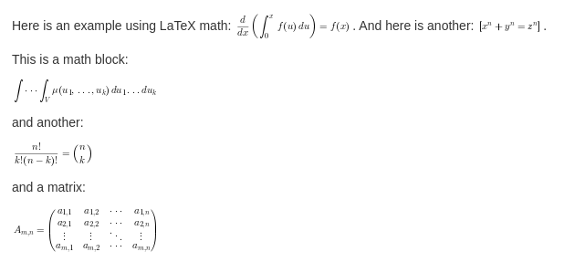

UML ([PlantUML](https://plantuml.com/)) and [Graphviz Dot](https://graphviz.org/) are also supported, delimited by

    ```uml
    ``` 

For example, below are some embedded UML blocks in a model file description text:

    Description = “””
    
    and a small one:
    
    ```uml
    Bob -[#red]> Alice : hello
    Alice -[#0000FF]->Bob : ok
    ```
    
    Note that according to https://plantuml.com/dot you can also use Graphviz/Dot diagrams instead of UML:
    
    ```uml
    digraph foo {
      node [style=rounded]
      node1 [shape=box]
      node2 [fillcolor=yellow, style="rounded,filled", shape=diamond]
      node3 [shape=record, label="{ a | b | c }"]
    
      node1 -> node2 -> node3
    }
    ```
    """

Below is the display produced from the above description text:

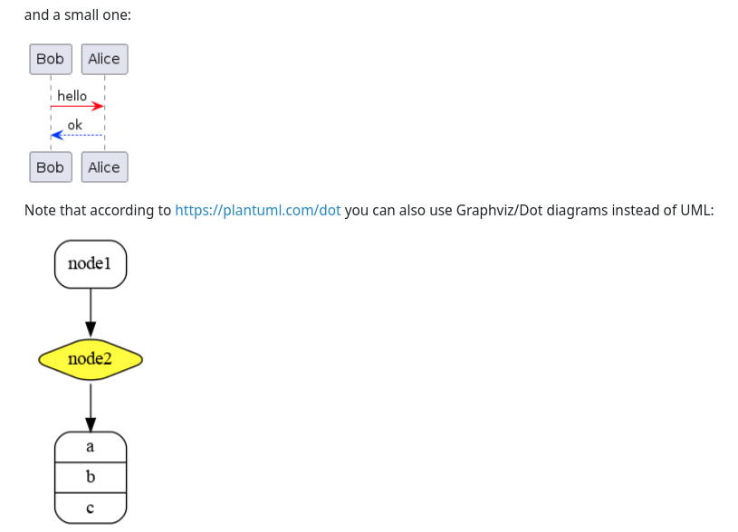

## Inner-Document Links

It is possible to make inner-document links to existing anchors using Markdown syntax. The easiest way to see the syntax
for the ids is to look at the generated HTML. For example, the output of:

    icd-db -s NFIRAOS -o NFIRAOS.html

Note that the name attribute is used in the generated HTML instead of id, since the PDF generator required that. Many of
the anchors have the following syntax:

*$thisComponent-$action-$itemType-$subsystem.$component.$name*

where

* *$thisComponent* is the component being described
* *$action* is one of {publishes, subscribes, sends, receives}
* *$itemType* is one of {Event, ObserveEvent, Alarm, Command}
* *$subsystem* is the subsystem for the item
* *$component* is the component for the item
* *$name* is the name of the item being published, subscribed to, or the command being sent or received

For example, to link to the description of a published event named `heartbeat` in the lgsWfs component in the TEST
subsystem:

    See: [here](#lgsWfs-publishes-Event-TEST.lgsWfs.heartbeat). 

## Reusing Definitions for Events, Commands, Parameters (refs)

It is possible to reuse similar parts of event, command and parameter definitions by using the `ref` keyword. The
example below uses a reference to an event (`engMode`) in another event (`engMode2`):

```
  events = [
    {
      name = engMode
      description = "LGS WFS engineering mode enabled"
      archive = false
      parameters = [
        ...
      ]
    }
    {
      name = engMode2
      description = "LGS WFS engineering mode 2 enabled"
      archive = true
      ref = engMode
    }
```

In the above example, the event `engMode2` will have the same settings and parameters as `engMode`, except
for `description` and `archive`, which are overridden. Any fields, which are not set, are inherited from the referenced
event. This works for events, commands and parameters, as shown in the parameter reference example below:

```
      parameters = [
        {
          name = mode3
          ref = engMode/parameters/mode
        }

```

In the above example, the parameter `mode3` will be exactly the same as the `mode` parameter in the `engMode` event in
the same component. You could also specify a different description field or any other parameter fields that should
override the ones defined for mode.

The syntax of the `ref` value is flexible and allows you to reference any event, command or parameter in any component
within the same subsystem. You can use a full path to specify a reference to an item in another component, or an
abbreviated path for items in the same scope. The full syntax of a ref is something like this:

*componentName/section/eventName[/parametersSection/paramName]*

For example, to reference an event, observe event or current state, use:

* componentName/events/eventName
* or componentName/observeEvents/eventName
* or componentName/currentState/eventName
* or events/eventName, ... (if in the same component)
* or just eventName (if in the same component and event type section)
  For commands received, the syntax is similar:
* componentName/receive/commandName
* or just commandName (if in the same component)

The syntax for references to parameters of events adds the `parameters` keyword and the parameter name:

* componentName/events/eventName/parameters/paramName

or abbreviated as described above for events:

* observeEvents/eventName/parameters/paramName (in same component)
* or eventName/parameters/paramName (in same component and events section)

Or just paramName (if in the same parameters section)

The syntax for parameters of commands is similar. Here you need to specify if the parameters appear in the “parameters”
section or in the “resultType”.

* componentName/receive/commandName/parameters/paramName
* or componentName/receive/commandName/resultType/paramName

Or abbreviated as described above.

See
the [example model files](https://github.com/tmtsoftware/icd/blob/master/examples/3.0/TEST/lgsWfs/publish-model.conf) in
the icd sources for some examples of the `ref` keyword.

@@@ note
If there is an error in the reference, the error message is displayed in the log output of the icd-db command, if it is
used, and also inserted in the generated HTML or PDF document (in the details section).
@@@

Below is an example that demonstrates some of the `ref` syntax for event parameters:

```
  events = [
    {
      name = engMode3
      description = "LGS WFS engineering mode enabled 3"
      archive = true
      parameters = [
        {
          // Example reference to a parameter in this component
          name = mode3
          ref = engMode/parameters/mode
        }
        {
          // Example reference to a parameter in this component (using wrong ref to produce error in HTML/PDF output)
          name = mode3Error
          ref = engMode/parameters/modeXXX
        }
```

@@@ note

Note: An earlier version of the icd software used the terms "attributes" for events parameters and "args" for command
parameters.
These have been renamed to "parameters" for compatibility with CSW, however for backward compatibility the previous
names are also allowed in refs.

@@@

## Using Jsonnet for Model Files

Normally, the icd model files are written in [HOCON](https://github.com/lightbend/config/blob/main/HOCON.md) format, a
simplified JSON format, and have a `.conf` suffix. In some cases, you may want to have more features available, for
example to refer to similar definitions in may different places. The icd software also supports model files using
the [jsonnet](https://jsonnet.org/) data templating language, which lets you define variables and functions and reuse
them. To do this, replace the `.conf` suffix with `.jsonnet` (or `.libsonnet` for jsonnet files you want to import) and
follow the syntax rules for jsonnet, so that the resulting JSON, after being processed by jsonnet conforms to the icd
JSON schema. The icd software will automatically preprocess the jsonnet model files when they are imported into the icd
database.

For example, you can add some common, reusable, top level definitions in a file `utils.libsonnet`:

```
// Define a common event
{
  heartbeat: {
    name: 'heartbeat',
    description: 'Heartbeat event description...',
    parameters: [
      {
        name: 'heartbeat',
        description: 'software heartbeat',
        type: 'integer',
      },
    ],
  },

  // Defines a function to generate a common event model based on the given arguments
  commonEventFunc(eventName, paramName, typeName):: {
    name: eventName,
    description: eventName + ' description.',
    archive: false,
    parameters: [
      {
        name: paramName,
        description: 'Description for ' + paramName,
        type: typeName,
      },
    ],
  },
}
```

And then reference these definition in a `publish-model.jsonnet` file for a different component. Below is an
example `publish-model.jsonnet` file that imports reusable jsonnet code:

```
// Import common function defined in another file
local utils = import '../utils.libsonnet';

{
  subsystem: 'TEST',
  component: 'jsonnet.example',

  // comments can use // or #
  publish: {
    description: |||
      Multi-line descriptions
      use this syntax in jsonnet
    |||,

    events: [
      // define two similar events using imported function
      utils.commonEventFunc('myEvent1', 'param1', 'boolean'),
      utils.commonEventFunc('myEvent2', 'param2', 'string'),

      // Insert an imported event definition
      utils.heartbeat,

      // define another event
      {
        name: 'state',
        // Import the description text
        description: importstr '../importRaw.txt'
,
        archive: false,
        parameters: [
          {
            name: 'state',
            description: 'Detector state',
            enum: ['EXPOSING', 'READING', 'IDLE', 'ERROR'],
          },
        ],
      },
    ],
  },
}
```

The above example defines two events (myEvent1 and myEvent2) that are similar, but configured based on the given
function arguments. The heartbeat event is used as is. The state event is defined in the usual way (for JSON), but
imports the description text from a file.

## Subsystem-model

The subsystem model describes the overall subsystem. There is one `subsystem-model.conf` file for each subsystem.

Each subsystem may consist of several components. The IDBS merges them to create a subsystem API or ICD.

As an example, the `subsystem-model.conf` JSON schema file is shown below. This schema file is being shown for
reference. Users are not expected to interact with the schema files directly, but rather use this manual to understand
how to structure their model files.

subsystem-model.conf JSON schema:

```
id: "http://csw.tmt.org/subsystem-schema#"
"$schema": "http://json-schema.org/draft-07/schema#"

description = "Defines the model describing a top level subsystem"
type = object
additionalProperties: false
required = [modelVersion, subsystem, title, description]
properties {
  _id {
    description = "Optional unique id (automatically generated)"
    type = string
  }
  _version {
    description = "Optional version (automatically generated)"
    type = integer
  }
  modelVersion {
    description = "The version of the model file as Major.Minor version"
    type = string
    pattern = "^[0-9]+\\.[0-9]+$"
  }
  subsystem {
    description = "The name of this Subsystem"
    include classpath("3.0/subsystem.conf")
  }
  title {
    description = "The title of this subsystem, for display"
    type = string
  }
  description {
    description = "A description of this subsystem"
    type = string
  }
}
```

The line starting with `required =` shows the required fields in the `subsystem.conf` file
are: `modelVersion`, `subsystem`, `title`, and `description`. The following lines in the schema file describe each of
the fields. Note also that `modelVersion` requires a pattern given by a regular expression. The modelVersion must be a
value like Major.Minor with at least 1 digit on each side of the period such as 3.0 (The latest version).

The fields for `subsystem.conf` are shown in the table below. The field name, whether it is required, and any special
notes for the field are shown. Notes include required formats or conventions for a value.

Required and optional fields for `subsystem.conf`:

| Field | Required? | Notes |
|------:|:---------:|:-------|
| modelVersion | yes | Must be a Major.Minor version with Major and Minor digits. Currently these values are supported: 1.0, 2.0, 3.0 (the latest version). |
| subsystem | yes | Name of the subsystem. Must be the same as SE subsystem name. |
| title | yes | The title of the subsystem. Will be displayed in generated documents. The title can contain spaces and other marks but should be one line. |
| description | yes | A description of the subsystem. The description is in triple quotes for multi-lined text. Note that spaces between paragraphs are retained and the text can contain GitHub flavored Markdown as well as HTML markup. |

The *modelVersion* is the model version for the entire subsystem. Each component also has a `modelVersion` field. This
allows each component to be updated independently and then the subsystem to be updated as a whole.

The subsystem field is the subsystem name. It must be one of the subsystem abbreviations from the SE N2 document. The
list is shown below.

```
// Enumeration including all available subsystems
enum = [
  ENC, // Enclosure
  SUM, // Summit Facilities
  STR, // Structure
  M2S, // M2 System
  M3S, // M3 System
  CLN, // Mirror Cleaning System
  TINS, // Test Instruments
  TCS, // Telescope Control System
  M1CS, // M1 Control System
  APS, // Alignment and Phasing System
  OSS, // Observatory Safety System
  ESEN, // Engineering Sensor System
  NFIRAOS, // Narrow Field Infrared AO System
  NSCU, // NFIRAOS Science Calibration Unit
  LGSF, // Lasert Guide Star Facility
  AOESW, // AO Executive Software
  CRYO, // Cryogenic Cooling System
  IRIS, // InfraRed Imaging Spectrometer
  MODHIS, // Multi-Object Diffraction-limited High-resolution Infrared Spectrograph
  REFR, // Refrigeration Control System
  WFOS, // Wide Field Optical Spectrometer
  CIS, // Communications and Information Systems
  CSW, // Common Software
  DMS, // Data Management System
  ESW, // Executive Software System
  SOSS, // Science Operations Support System
  DPS, // Data Processing System
  SCMS // Site Conditions Monitoring System
]
```

The example below will create a TCS subsystem. The description comes from the text of the TCS CoDR software design
document. Triple quotes allow multi-line entries.

```
subsystem=TCS
title="TELESCOPE CONTROL SYSTEM (TCS)"
modelVersion="3.0"
description="""
The main functions of the TCS are: 
1) Points and tracks targets in various reference frames by generating position demands for subsystems and instruments. Generates pointing models to remove repeatable mechanical errors and applies pointing models terms to correct mount demands.
2) Implements a key part in acquisition, guiding and wavefront sensing 
…
"""
```

## Optional *$subsystem*-icd-model file

There may be zero or more of these model files in the top level directory (which also contains `subsystem-model.conf`).
Replace *$subsystem* with the name of the other subsystem that has an interface with the one being defined. For example,
if you are defining the NFIRAOS subsystem model files and want to include extra information about the ICD between IRIS
and NFIRAOS, you could add a file named `IRIS-icd-model.conf`:

```
subsystem = NFIRAOS
title = "Interface between NFIRAOS and IRIS"
description = """
The communication, software and control interfaces between NFIRAOS and IRIS consist of the following:
* Transfer of pixel compression gain and offset coefficients from the OIWFS detector controller to the NRTC.
* Transfer of pixel compression gain and offset coefficients from the IRIS Imager detector controller to the NRTC.
* Transfer of residual field rotation angle OIWFS from the NFIRAOS RTC to the IRIS SRO.
* Transfer of the IRIS OIWFS ADC ellipticity correction streams from the NFIRAOS RTC to the IRIS SRO. The corrections include the widths of the elliptical Gaussian image and angle between the ellipse axis and the local X axis.
* Transfer of the IRIS OIWFS pixels from the IRIS OIWFS detector controllers to the NFIRAOS RTC.
* Transfer of the IRIS ODGW pixels from the IRIS detector controllers to the NFIRAOS RTC.
* Transfer of probe position errors due to TT offloading from the NFIRAOS RTC to the IRIS SRO.
* Transfer of the NFIRAOS Optical Enclosure state to the OIWFS Enclosure.
* Bi-directional sharing of respective temperatures of NFIRAOS and OIWFS enclosures
* Transfer of NFIRAOS configuration, state, and performance information to the IRIS Data Reduction System (DRS).
"""
```

The fields in the `$subsystem-icd-model.conf` file are shown below:

| Field | Required? | Notes |
|:------|:----------|:-------|
| subsystem | yes | Name of the subsystem being defined (same as in subsystem-model.conf) |
| title | no | Optional title to be displayed before the description (If missing, a default title will be used) |
| description | yes | Text describing the interface between the two subsystems (may include Markdown, HTML) |
| targetSubsystem | no | Name of the other subsystem that has an interface with this one (Defaults to the one in the file name) |


## Component-model

There is one `component-model.conf` file for each component in the subsystem. The component model file provides high level information about the component. The fields of the `component-model.conf` are shown in the following table:

|Field| Required?| Notes|
|----:|:--------:|:-----|
|modelVersion| yes| This is the modelVersion for a single component. It must be a Major.Minor version with Major and Minor digits (1.0, 2.0 and 3.0 are currently supported).|
|subsystem| yes| Name of the subsystem the component belongs to. It must be an entry from the SE subsystem list.|
|wbsId| no| The WBS element from the cost book this component belongs to such as: TMT.TEL.CONT.TCS.|
|componentType| yes| Must be: Assembly, HCD, Sequencer, Application, or Container|
|component| yes| The name of the component. Will be displayed in documents. The component name may contain spaces and dots, but, as of modelVersion 2.0, not a dash “-“. The prefix for a component, which is needed to subscribe to events, is defined as subsystem.component.|
|title| yes| The title of the component. Will be displayed in documents. The title can include spaces but should be one line.|
|description| yes| A description of the component (may contain Markdown or HTML markup). The description is in triple quotes for multi-lined text. Note that spaces between paragraphs are retained.|

An example `component-model.conf` file (for the TCS Pointing Kernel Assembly, described in the TCS CoDR WBS) is shown below:

```
subsystem = TCS
component = TCS PK Assembly
modelVersion = "3.0"
wbsId = tmt.tel.cont.tcs.tpk
title = "Telescope Pointing Kernel Assembly"
componentType = Assembly

description = """
Pointing Kernel Assembly is responsible for receiving target and offset commands. Based on targets received assembly will produce stream of target demands that will be used by
tracking mechanism in Mount,Enclouser,Rotator,Guiders,Probes etc. Pointing Kernel Assembly utilizes C++ based third party libraries like tpk,slalib,tcspk.
""" 
```

The icd-db program can output a document in PDF or HTML format with the –o option. The figure below shows a portion of the PDF output related to the  above `component-model.conf` file:

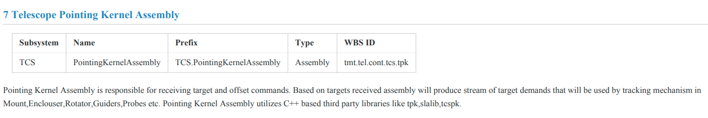

## Parameters, Types and Units

The following two sections describe events and commands, both of which can have sets of parameters. A parameter can have a number of fields defined in the file `parameter-schema.json`. Minimally, it must be a `name`, `description`, and `type` or a `name`, `description`, and `enum` (enumeration). Parameter fields are described in the table below. Parameter field names must be unique within an event item.

The table below lists the set of required fields for parameters. Note that `yes/no` here means that one of `type` or `enum` is required, but both are not possible in the same parameter.

|Field| Required?| Notes|
|----:|:--------:|:-----|
|name| yes| The name of a parameter in the enclosing item.|
|description| yes| A text description of the parameter.|
|type| yes/no| The type of a value or array. Can be one of: `array`, `boolean`, `integer`, `string`, `byte`, `short`, `long`, `float`, `double`, `taiTime`, `utcTime`, `eqCoord`, `solarSystemCoord`, `minorPlanetCoord`, `cometCoord`, `altAzCoord`, `coord` <br/>(corresponding to supported types in the CSW software: See below).|
|enum| yes/no| An enum as in `enum = {A, B}`|

Other fields can be optionally added to the parameter as needed, depending on the type of parameter. For values that have units, the units must be one of the allowed CSW units (see below).

|Field| Required?| Notes|
|----:|:--------:|:-----|
|units| yes if possible| The units of a value in a parameter. See below for allowed values.|
|minItems| no| If the parameter is a one-dimensional array, this specifies the minimum number of items in the array.  Can also be specified using the dimensions field for arrays types (see below).|
|maxItems| no| If the parameter is a one-dimensional array, this specifies the maximum number of items in the array.  Can also be specified using the dimensions field for arrays types (see below).|
|minLength| no| For string parameters, the minimum expected string length.|
|maxLength| no| For string parameters, the maximum expected string length.|
|dimensions| no| If the parameter value is a multi-dimensional array, this is an array of dimension sizes for the value.|
|minimum| no| When a value can be a range, this is the minimum possible (a number or -inf).|
|maximum| no| When a value can be a range, this is the maximum possible (a number or inf).|
|exclusiveMinimum| no| When a value can be a range, this is the minimum possible, exclusive of this value (a number or –inf).|
|exclusiveMaximum| no| When a value can be a range, this is the maximum possible, exclusive of this value (a number or inf).|
|default| no| This is the default value for the parameter, if there is one.|
|allowNaN| no| Set to true if the parameter value can be NaN (default: false)|

## FITS Keywords

In addition to the above fields, event parameters may contain fields with information about the FITS keywords for which the parameter is the source:

|Field| Required?| Notes|
|----:|:--------:|:-----|
|keyword| no| This is the name of the FITS keyword generated from the parameter value.|
|channel| no| If the FITS keyword has multiple source parameters, this specifies the  channel name for this source.|
|keywords| no| Use if multiple FITS keywords are produced from this event parameter (See below).|

For the `keywords` field in the above table: If multiple keywords are produced from an event parameter (from different parts of an array or matrix), this form can be used:

```
keywords: [
  {
    keyword = OIWFS1PS
    rowIndex = 0
  }
  {
    keyword = OIWFS2PS
    rowIndex = 1
  }
  {
    keyword = OIWFS3PS
    rowIndex = 2
  }
]
```

In this format, `rowIndex` refers to a row in a matrix parameter value, while `index` refers to an index in the parameter value array.

## Parameter Types

The table below lists the available types for parameters, which correspond to the supported parameter types in the CSW framework. Note that a parameter in CSW can always have multiple values. It is not necessary (or supported) to define an array of strings or booleans, since a string or boolean parameter can already have multiple values.

|Type| Description|
|:---|:-----------|
|boolean,integer, string, byte, short, long, float, double| Values have the corresponding primitive types in Scala, Java, Typescript, etc.|
|array| An array or matrix of (lists of) numerical values (not string or boolean)|
|taiTime, utcTime| Holds TAI or UTC time values|
|EqCoord, solarSystemCoord, minorPlanetCoord, cometCoord, altAzCoord, coord| See the CSW source for details of these coordinate parameter types. <br/>Note that coord (CSW Coord) is a base type that can be used for any of the coordinate types.|

If the parameter type is an array, there are some special tags for describing it.  The minItems and maxItems parameters can be used for 1-Dimensional arrays and is especially useful for arrays with a variable length.  However, for other arrays, including higher dimensional arrays, a dimensions tag can be used, with a syntax of [x,y,z,…] where x, y, and z are positive integers specifying the size of each dimension.  Note that the CSW framework only supports numerical array and matrix types, although each item of the array or matrix can be a list of one or more values.

To describe the items in an array, an “items” block is used.  Within it, the type is set using the type field.  The mimimum, maximum, exclusiveMinimum, and exclusiveMaximum fields may be used as well.

In the CSW framework, only numerical array parameter types are supported, however since every parameter may have multiple values, it is usually not necessary to declare the type as an array.

Note that the value of the mimimum, maximum, exclusiveMinimum, and exclusiveMaximum fields may be numeric or “inf” or “-inf” (for +/- infinity). 

## Units

The CSW software defines a list of standard units that are accepted. If not in this list, please add it to the description field and/or request that it be added to the standard list. 

Note: This list can be found in the icd source tree under `icd-db/src/main/resources/3.0/units.conf`

```
// Enumeration including all available CSW units

enum = [
  // SI units
  angstrom    // angstrom
  alpha       // alpha: fine structure constant
  ampere      // ampere: unit of electric current
  arcmin      // arc minute; angular measurement
  arcsec      // arc second: angular measurement
  bar         // bar: metric ton of pressure
  candela     // candela(lumen/sr)
  day         // day
  degree      // degree: angular measurement 1/360 of full rotation
  degC        // Degree Celsius K
  degF        // Fahrenheit
  elvolt      // electron volt
  gauss       // gauss
  gram        // gram
  hertz       // frequency
  henry       // Henry
  hour        // hour
  joule       // Joule: energy
  kelvin      // Kelvin: temperature with a null point at absolute zero
  kilogram    // kilogram, base unit of mass in SI
  kilometer   // kilometers
  liter       // liter, metric unit of volume
  lm          // lumen
  lsun        // solar luminosity
  lx          // lux(lm/m2)
  mas         // milli arc second
  me          // me(electron_mass)
  meter       // meter: base unit of length in SI
  microarcsec // micro arcsec: angular measurement
  millimeter  // millimeters
  millisecond // milliseconds
  micron      // micron: alias for micrometer
  micrometer  // micron
  minute      // minute
  MJD         // Mod. Julian Date
  mol         // mole- unit of substance
  month       // Month name or number
  mmyy        // mmyy: Month/Year
  mu0         // mu0: magnetic constant
  muB         // Bohr magneton
  nanometer   // nanometers
  newton      // Newton: force
  ohm         // Ohm
  pascal      // Pascal: pressure
  pi          // pi
  pc          // parsec
  ppm         // part per million
  radian // radian: angular measurement of the ratio between the length of an arc and its radius
  second // second: base unit of time in SI
  sday   // sidereal day is the time of one rotation of the Earth
  steradian // steradian: unit of solid angle in SI
  volt      // Volt: electric potential or electromotive force
  watt      // Watt: power
  Wb        // Weber
  week      // week
  year      // year

  // CGS units
  coulomb    // coulomb: electric charge
  centimeter // centimeter
  D          // Debye(dipole) A electric dipole moment
  dyn        // dyne: Unit of force
  erg        // erg: CGS unit of energy

  // Astropyhsics units
  au        // astronomical unit: approximately the mean Earth-Sun distance
  a0        // bohr radius: probable distance between the nucleus and the electron in a hydrogen atom in its ground state
  c         // c: speed of light
  cKayser   // cKayser
  crab      // Crab: astrophotometrical unit for measurement of the intensity of Astrophysical X-ray sources
  damas     // damas: degree arcminute arcsecond (sexagesimal angle from degree)
  e         // electron charge
  earth     // earth (geo) unit
  F         // Farad: F
  G         // gravitation constant
  geoMass   // Earth Mass
  hm        // hour minutes (sexagesimal time from hours)
  hms       // hour minutes seconds (sexagesimal time from hours)
  hhmmss    // hour minutes seconds (sexagesimal time)
  jansky    // Jansky: spectral flux density
  jd        // Julian Day
  jovmass   // Jupiter mass
  lightyear // light year
  mag       // stellar magnitude
  mjup      // Jupiter mass
  mp        // proton_mass
  minsec    // minutes seconds (sexagesimal time from minutes)
  msun      // solar mass
  photon    // photon
  rgeo      // Earth radius (eq)
  rjup      // Jupiter Radius(eq)
  rsun      // solar radius
  rydberg   // energy of the photon whose wavenumber is the Rydberg constant
  seimens   // Seimens
  tesla     // Tesla
  u         // atomic mass unit

  // Imperial units
  barn  // barn: metric unit of area
  cal   // thermochemical calorie: pre-SI metric unit of energy
  foot  // international foot
  inch  // international inch
  pound // international avoirdupois pound
  mile  // international mile
  ounce // international avoirdupois ounce
  yard  // international yard

  // Others - engineering
  NoUnits // scalar - no units specified
  bit     // bit: binary value of 0 or 1
  encoder // encoder counts
  count   // counts as for an encoder or detector
  mmhg    // millimetre of mercury is a manometric unit of pressure
  percent // percentage
  pix     // pixel

  // Datetime units
  tai      // TAI time unit
  utc      // UTC time unit
  date     // date
  datetime // date/time
]
```

## Parameter Examples

Below are some examples of parameter definitions:

```
parameters = [
        {
          name = temp_ngsWfs
          description = "NGS WFS temperature"
          type = float
          units = kelvin
          exclusiveMinimum: -inf
          exclusiveMaximum: inf
          allowNaN: true
	    keyword = IMGTMPXX
        }
        {
          name = temp_lgsWfs
          description = "LGS WFS temperature"
          type = float
          units = kelvin
          exclusiveMinimum: 0
          exclusiveMaximum: 100
          allowNaN: true
        }
        {
          name = temp_ndme
          description = "NDME crate temperatures"
          type = array
          dimensions: [7]
          items = {
            type = float
            units = kelvin
          }
        }
        {
          name = temp_actuator
          description = "motor & piezo actuator temperatures"
          type = array
          dimensions: [30]
          items = {
            type = float
            minimum = 1.234
            units = kelvin
          }
        }
      ]
```

## Publish-model

Each component can publish events, observe events, images and current state. Other systems can subscribe or get these. A component’s published events and images are described in the `publish-model.conf` file. The file consists of some high-level content and then sections for events, observeEvents, images and currentState.  

@@@ note

As per Change Request 261, the telemetry and event services have been merged into one unified service, and telemetry items distinct from events have been eliminated.  Furthermore, events and event streams have also been consolidated into a single event type.  

@@@

The table below lists the required and optional fields for `publish-model.conf`:

|Field| Required?| Notes|
|----:|:--------:|:-----|
|subsystem| yes| Name of the subsystem. Must be the same as SE subsystem name. Should be the same as the component-model.conf and subsystem-model.conf|
|component| yes| The name of the component.|
|publish| yes| This is a container for the kinds of data the system publishes. It is required.|

The publish block contains a description and then containers for the different kinds of publishable events. The table below lists the fields for the required publish block:

|Field| Required?| Notes|
|----:|:--------:|:-----|
|description| no| Optional overview or notes on items published by the component.|
|events| no| Block for events that are published by the component|
|observeEvents| no| Block for observe events that are published by the component. There is a list of predefined observe events (see below).|
|images| no| Block for images that are published by the component.|
|currentStates| no| Block for current states that are published by the component.|
|alarms| no| Block for alarms published by the component (Deprecated: See `alarm-model.conf` below).|

Note that the publish-model.conf file is not required if the container does not publish any events or . Note also that none of the fields of the publish container are required. Adding a publish-model.conf file to the component model that is empty will create an empty section in the documentation (In that case it would  be preferable to leave out the publish-model.conf file). The following tables discuss each of the different kinds of events.

## Events

The event container is an array containing one or more event items.

Events fall into the following categories. The purpose of the categories is to easily find events of different categories without a catalog.

|Category| Description|
|-------:|:-----------|
|DEMAND| An event that is used to transmit a desired position. These events are high frequency/periodic and should not be archived long-term or should be seriously curated into a smaller representative collection.|
|CONTROL| Similar to a DEMAND, but probably not periodic and considerably less frequent. CONTROL events are events driving other devices, but may be internal to a system. These also may be curated.|
|EVENT| An event that is used to indicate that something has happened.  Observe Events are one EVENT type.|
|STATUS| (Default) Used primarily to update a user interface.  These events are archived.  They are not high frequency and are not periodic.|

The fields of an event item are shown in the table below:

|Field| Required?| Notes|
|----:|:--------:|:-----|
|name| yes| The name of the event item. This should be a simple name like “zenithAngle”. The prefix for all events is subsystem.component.|
|category| no| The event category (One of: DEMAND, CONTROL, EVENT, STATUS).|
|description| no| An optional description of a single event item (may contain Markdown and HTML). The description is in triple quotes for multi-lined text. Note that spaces between paragraphs are retained.|
|requirements| no| List of requirements that flow to this item.|
|maxRate| no| Maximum publishing rate in Hz.|
|archive| no| A Boolean (true/false) stating whether the component recommends archiving this eventitem.|
|archiveDuration| if archive is true| Lifetime of the archiving (for example ‘2 years’ or ‘6 months’)|
|parameters| yes| A container of parameters that belong to this event item.|

Unlike an EPICS channel, a CSW event can contain several associated keys and values (called parameters in the schema).

An excerpt from an example `publish-model.conf` file for the TCS pk Assembly is shown below. It shows part of the definition of the zenithAngle event.

```
publish {
    event = [
    {
      name = zenithAngle
      description = """
       |The zenith angle is the distance in degrees of the telescope's optical axis from the zenith.
       |
       |The zenithAngle event item includes both the zenith angle for the current position of the
       |telescope
       |as well as the demanded zenith angle. When the telescope is tracking, the error between 
       |demand and current should be zero.
       |"""
      requirements = [“REQ-2-TCS-4270”]
      maxRate = 20
      archive = true
      archiveDuration = 1 year
      parameters = [
        {
          name = current
          description = "Actual or current zenith angle of the telescope"
          type = float
          minimum = 0
          maximum = 90
          units = degree
        }
        {
          name = demand
          description = "The demanded zenith angle of the telescope"
          type = float
          minimum = 0
          maximum = 90
          units = degree
        }
      ]
    }
```

The annotated screenshot below shows the portion of the file generated by the command: `icd-db -s TCS –o TCS.pdf`, which generates a PDF file for the TCS subsystem. The figure shows where each of the fields ends up on the final product.

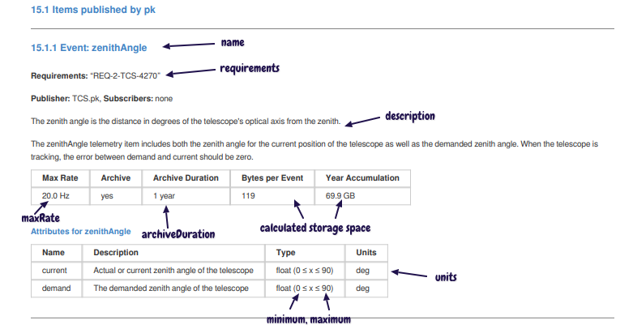

## Observe Events

Observe events are different from other events in that they are predefined. For this reason you only need to list the name of the observe event in the publish model file under `observeEvents`. For example:

```
observeEvents = [
    ObserveStart
    ObserveEnd
]
```

The predefined observe event names are references to the [tmt-icd/ESW-Model-Files definitions on GitHub](https://github.com/tmt-icd/ESW-Model-Files/tree/master/observe-events).

Below is an example that references all the predefined observe events:

```
  observeEvents = [
    ObserveStart
    ObserveEnd
    ExposureStart
    ExposureEnd
    ReadoutEnd
    ReadoutFailed
    DataWriteStart
    DataWriteEnd
    ExposureAborted
    PrepareStart

    // IRDetector specific
    IRDetectorExposureData
    IRDetectorExposureState

    // OpticalDetector specific
    OpticalDetectorExposureData
    OpticalDetectorExposureState

    // WFSDetector specific
    WfsDetectorExposureState
    PublishSuccess
    PublishFail

    // Sequencer specific
    PresetStart
    PresetEnd
    GuidestarAcqStart
    GuidestarAcqEnd
    ScitargetAcqStart
    ScitargetAcqEnd
    ObservationStart
    ObservationEnd
    ObservePaused
    ObserveResumed
    DowntimeStart

    // DMS specific
    MetadataAvailable
    ExposureAvailable
  ]
```

## Images

The images section of the `publish-model.conf` file is used to declare that a component publishes images that other components can subscribe to (via the TMT VIZ APIs that are to be defined).

The images container is an array containing one or more image description items. The fields of an image item are shown in the following table:

|Field| Required?| Notes|
|----:|:--------:|:-----|
|name| yes| The name of the image item. This should be a simple name like “guider1”. The prefix for all images is subsystem.component.|
|description| yes| A description of a single image item (may contain Markdown and HTML). The description is in triple quotes for multi-lined text.|
|channel| yes| The VIZ image channel (for example: viz.wfos.agwfs1)|
|format| no| The image format (default: FITS)|
|size| yes| An array of two numbers: the image dimensions (for example: [2048, 2048]])|
|pixelSize| yes| Number of bytes per pixel|
|maxRate| no| Maximum rate the image is published|
|metadata| yes| A container of one or more metadata items that belong to this image.|

The format of a single metadata item for an image is shown in the table below:

|Field| Required?| Notes|
|----:|:--------:|:-----|
|name| yes| Name of the image metadata|
|description| yes| A description of this metadata|
|type| yes| The data type of the keyword value (One of: [boolean, integer, string, byte, short, long, float, double])|
|keyword| no| FITS keyword (for example: SCALE, ITIME)|

Below is an example section of a `publish-model.conf` file that shows two published images. Other components can then reference these images in the `subscribe-model.conf` file to indicate that they will subscribe to the published images.

```
  images = [
    {
      name = guider1
      description = "Images from the WFOS AGWFS 1"
      channel = viz.wfos.agwfs1
      format = FITS
      size = [2048, 2048]
      pixelSize = 2
      maxRate = 5.0
      metadata = [
        {
          name = platescale
          type = float
          description = "platescale of image in arcsec/pixel"
          keyword = SCALE
        }
        {
          name = integrationTime
          type = integer
          description = "integration time of image in ms"
          keyword = ITIME
        }
      ]
    }
    {
      name = guider3
      description = "Images from the WFOS AGWFS 3"
      channel = viz.wfos.agwfs1
      format = FITS
      size = [2048, 2048]
      pixelSize = 2
      maxRate = 5.0
      metadata = [
        {
          name = platescale
          type = float
          description = "platescale of image in arcsec/pixel"
          keyword = SCALE
        }
        {
          name = integrationTime
          type = integer
          description = "integration time of image in ms"
          keyword = ITIME
        }
      ]
    }
  ]
```

## Other Event Types

Some events signal an occurrence of an activity in a component that other systems use to synchronize actions. Some, like observe events, are system defined. They are not periodic, so a rate is not necessary. The `publish-model.conf` file has a container for events the component publishes that includes an array of one or more events.

Current states, which are published by HCDs for assemblies, are not actually events, but are structured the same, and written in the `currentStates` block instead of the `events` block.

Events and current states have the same schema, with a `name`, `description`, and parameters describing the event data. Below is an example current state event described in the `publish-model.conf` file:

```
  currentStates = [
    {
      name = "nacqUnarchived"
      archive = false
      parameters = [
        {
          name = nacq_detector_state
          description = "current state of the NACQ detector"
          enum = [EXPOSING, READING, IDLE, ERROR]
        }
        {
          name = nacq_period
          description = "NACQ continuous read period"
          type = float
          units = seconds
        }
        {
          name = nacq_contRead
          description = "NACQ continuous read state enabled"
          type = boolean
        }
        {
          name = nacq_mag_position
          description = "NACQ magnifier stage motor position"
          type = float
          // units = TBD
        }
        {
          name = nacq_position
          description = "nominal position of the NACQ/NHRWFS stage for the NACQ "
          // array of 3 floating point numbers in mm
          type = array
          dimensions: [3]
          items = {
            type = float
          }
          units = mm
        }
      ]
    }
```

The screenshot below shows part of the PDF display for the above CurrentStates example:

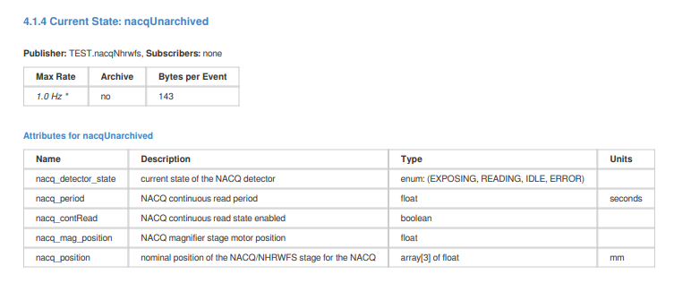

## Service Model File

Another optional icd model file is `service-model.conf`. It is used to describe HTTP services provided by or consumed by a component. The actual HTTP services are described in [OpenAPI](https://swagger.io/specification/) files that are also stored in the icd database.

On the consumer side, the file can indicate which routes of the HTTP service it uses.

Here is an example consumer service-model.conf:

```
subsystem = TEST
component = env.ctrl

requires = [
  {
    subsystem = TEST2
    component = SegmentService
    name = esw-segment-db
    // Optional routes / paths used
    paths = [
      {
        path = /setPosition
        method = post
      },
      {
        path = /currentPositions
        method = get
      }
    ]
  }
]
```

The above example states that the component uses the HTTP methods `POST /setPosition` and `GET /currentPositions` from the service. The paths are optional and just for information. The generated documentation for an ICD between two subsystems or components will only display the parts of HTTP services that are declared as being used (in the paths array). By default, if the paths are not specified, the complete service API will be included in the ICD documentation.

In the example `service-model.conf` file from a service provider below, the line:

    openApi = esw-segment-db.json

points to the OpenAPI definition for the HTTP service that is being provided (The OpenAPI file should be in the same directory as the `service-model.conf` file and can be in JSON or YAML format and have the suffix `.json`, `.yaml` or `.yml`). Both the service-model information and the contents of the OpenAPI file are stored in the icd database where they are used to produce documentation (YAML files are first converted to JSON).

service-model.conf:
```
subsystem = TEST2
component = SegmentService

provides = [
  {
    name = esw-segment-db
    description = "HTTP API to ESW Segment DB service, used for keeping track of TMT mirror segments"
    openApi = esw-segment-db.json
  }
]
```

The screenshot below shows how the above service provider info is displayed in the icd web app:

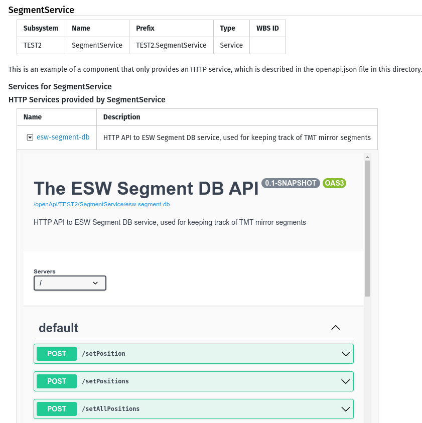

If you click on the small button in the Name column, the detailed display is toggled open or closed. If you click on the link next to it, the documentation for the HTTP service is opened in a new tab. The format of the documentation for HTTP services is different from that of events, since it is provided by the [swagger-ui](https://swagger.io/tools/swagger-ui/) library. The PDF version is somewhat simpler and is provided by the [swagger-codegen](https://swagger.io/tools/swagger-codegen/) command line application.

Note that each component can declare multiple services consumed and/or provided in the `service-model.conf` file. You can find example `service-model.conf` files and OpenAPI files in the [examples/3.0](https://github.com/tmtsoftware/icd/tree/master/examples/3.0) directory in the icd sources.

## Alarms

An alarm is published to mark an abnormal condition that requires attention. Alarms are not errors; they are conditions that occur asynchronously while components are executing or inactive. 

The alarm feature has been redesigned for the CSW PDR in response to CoDR comments.  The structure of the model follows the design of the Alarm Configuration file, which provides a listing of all possible alarms within the Observatory, as well as information for the operator to respond to the alarm.

The table below lists the required and optional fields for an alarm definition in `alarm-model.conf`:

|Field| Required?| Notes|
|----:|:-----:|:-------|
|name| yes| Name of the alarm, which should be one word.|
|description| yes| A description of the alarm including what is the cause and possible response. The description is in triple quotes for multi-lined text. Note that spaces between paragraphs are retained.|
|requirements| no| List of requirements that flow to this alarm|
|severityLevels| yes| An array of severity levels that the alarm can have (besides `Disconnected`, `Indeterminate`, `Okay`): Default is any severity. Possible values are: `Warning`, `Major`, `Critical`.|
|location| yes| A text description of where the alarming condition is located|
|alarmType| yes| The general category for the alarm: One of: `Absolute`, `BitPattern`, `Calculated`, `Deviation`, `Discrepancy`, `Instrument`, `RateChange`, `RecipeDriven`, `Safety`, `Statistical`, `System`|
|probableCause| yes| The probable cause for each level or for all levels|
|operatorResponse| yes| Instructions or information to help the operator respond to the alarm|
|autoAck| yes| Does this alarm automatically acknowledge without operator?|
|latched| yes| Does this alarm latch?|

Below is an example `alarm-model.conf` file:

```
subsystem = TEST
component = env.ctrl

alarms = [
    {
      name = limit
      description = "The NGS FSM stage has reached a limit. It is not possible to position the FSM."
      requirements = [TBD]
      severityLevels = [Major]
      location = "NGS FSM stage"
      alarmType = System
    probableCause = "The PFSM HCD was commanded without the knowledge of the assembly, or the configured soft limits are incorrect"
      operatorResponse = "Execute the datum command"
      autoAck = false
      latched = true
    }
  ]
```

The PDF output generated from this part of the `alarm-model.conf` file is shown below:

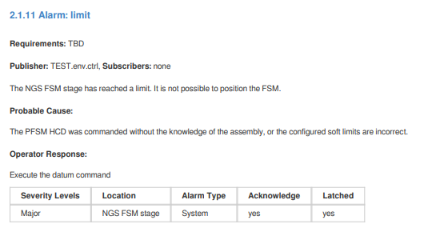

@@@ note

In previous icd versions, the alarms were listed in the publish-model.conf file and this is still supported for backward compatibility.

@@@

## Subscribe-model

The `subscribe-model.conf` file lists the event information a component subscribes to from other components. The `subscribe-model.conf` file is simpler than the `publish-model.conf` file, containing only references to the published items.

Like `publish-model.conf`, the `subscribe-model.conf` file includes sections for each of the kinds of events or images that are available: `events`, `observeEvents`, `images` and `currentStates`.  Each section is an array of items with the same fields as shown in the table below. Only the `subsystem`, `component`, and `name` fields are required.

|Field| Required? | Notes|
|----:|:---------:|:-----|
|subsystem| yes| Name of the publisher’s subsystem.|
|component| yes| Name of the component publishing the item.|
|name| yes| The simple name of the item such as: zenithAngle.|
|usage| no| Describes how the item is being used by the subscriber|
|requiredRate| no| The rate the subscriber needs updates of the item in order to operate properly (in Hz). This may not be the rate that the publisher publishes.|
|maxRate| no| The maximum rate at which the subscriber can process the item (in Hz).|

Below is an example `subscribe-model.conf` file for an IRIS component called `oiwfs_adc_assembly` that uses the published data of the TCS.

```
subsystem = IRIS
component = oiwfs_adc_assembly

subscribe {
  events = [
    {
      subsystem = TCS
      component = cmIRIS
      name = oiwfs1AtmDispersion
      usage = "Atmospheric dispersion stream"
      requiredRate = 1
    }
    {
      subsystem = TCS
      component = cmIRIS
      name = oiwfs2AtmDispersion
      usage = "Atmospheric dispersion stream"
      requiredRate = 1
    }
    {
      subsystem = TCS
      component = cmIRIS
      name = oiwfs3AtmDispersion
      usage = "Atmospheric dispersion stream"
      requiredRate = 1
    }
    {
      subsystem = IRIS
      component = oiwfs_poa_assembly
      name = POS_current
      usage = "Current OIWFS probe rotations needed to set correct ADC orientations"
    }
    {
      subsystem = NFIRAOS
      component = rtc
      name = oiwfsImage
      usage = "OIWFS ellipticity correction stream for ADCs"
    }
  ]
}
```

Events have been redesigned for the CSW PDR. Components write their data and other systems sample it at the rate they need. `requiredRate` allows a component to state a rate they require to operate properly. It’s up to the publisher to make sure that they can provide that rate. This is part of checking interfaces.

There is minimal documentation for subscribe items. The full description of an item belongs with the publisher, not the subscriber. The subscriber is only referencing its use of information published by another component.

The `name` field must match the name of published item in another component. It must be spelled correctly. The best way is to browse the API of the source system and copy the full path.

By default, subscribed events are not displayed in API documents. To include them, pass the `–clientApi` option to `icd-db`, or select the `Include client API information` check box in the web app.

The figure below shows a section of the display of the icd web app for the above `subscribe-model.conf` file. The descriptions are looked up in the database (originally from `publish-model.conf` files in other components).

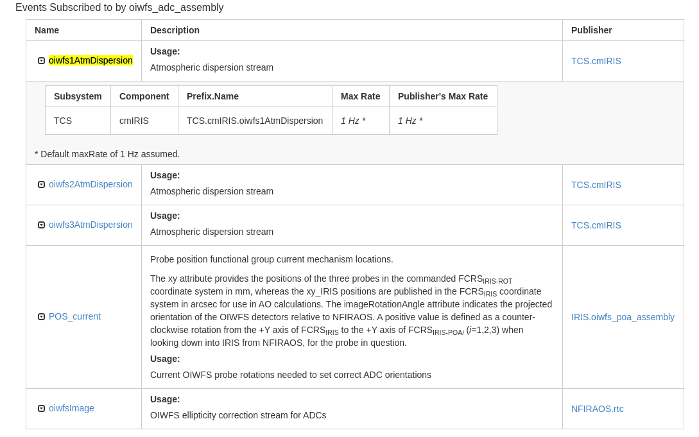

See also the example subsystems in the icd GitHub repo that show the different types of events and images used in the `subscribe-model.conf` files. 

## Command-model

The `command-model.conf` file describes the submit commands the component accepts (receive) and the submit commands it sends to other components it depends on (send). As in other sections, there is a block for the `send` and `receive` entries. The required and optional fields of `command-model.conf` are shown in the table below:

|Field| Required?| Notes|
|----:|:-------:|:------|
|subsystem| yes| Name of the subsystem. Must be the same as SE subsystem name.|
|component| yes| Name of the component that uses this command-model.conf file. Should match name used elsewhere.|
|receive| yes| The block for commands this component supports.|
|description| no| An optional overall description of the commands received by the component. The description is in triple quotes for multi-lined text.|
|send| no| The block for commands this component sends to other components.|

The `receive` block holds an array of items that are descriptions of commands the component receives or accepts. 

The required and optional fields of the `receive` block are shown in table below.

|Field| Required?| Notes|
|----:|:--------:|:-----|
|name| yes| Name of the command (appended to prefix).|
|description| yes| A description of the command.|
|requirements| no| A list of one or more TMT requirements that are associated with this command.|
|preconditions| no| List of preconditions for this command, including safety.precautions. Unless otherwise documented, it is assumed that the conditions ALL need to be met.|
|postconditions| no| List of postconditions for this command, including safety precautions. Unless otherwise documented, it is assumed that the conditions ALL need to be met.|
|requiredArgs| no| A list of command arguments (parameters) that are required.|
|parameters| no| The block for arguments the command supports. Parameters are as described for events. |
|completionType| no| Indicates the completion type of a command: See CSW CommandService API for details. Possible values: `immediate`, `longRunning`, `oneway` (default: `immediate`).|
|resultType| no| Defines a list of parameters in the result (For commands that return a result) in the same format as the command parameters.|
|completionCondition| no| For oneway commands, a list of conditions (string text) for determining command completion (if applicable). Unless otherwise documented, it is assumed that the conditions ALL need to be met.|
|role| no| The user role required in order to execute this command (one of: `eng`, `admin` or `user`). Some commands may be protected and only allowed for engineering or admin users. The default required role is a regular `user` role.|

The contents of the parameters and `resultType` containers are parameters as described for events in a previous section.

The `send` block contains a list of commands this component sends to other components. The required fields for each item in the list are shown in the following table.

|Field| Required?| Notes|
|----:|:--------:|:-----|
|subsystem| yes| The TMT subsystem for the component that receives the command|
|component| yes| Name of the component that receives the command. Should match name used elsewhere.|
|name| yes| name of the command|

An example of the beginning and the `receive` block from a `command-model.conf` file for is shown below.

```
subsystem = TEST
component = lgsWfs

description = "Example Commands …"

receive = [
  {
    name = LGS_WFS_INITIALIZE
    description = """
       |LGS_WFS_INITIALIZE command will:
       |* disable the LGS WFS engineering continuous read mode (if required)
       |* (re)connect to the LGS WFS HCD
       |* set LGS WFS exposure parameters to default values
    """
    requirements = ["INT-TEST-AOESW-1000"]
    parameters = [
      {
        name = wfsUsed
        description = "OIWFS used"
        type = string
      }
    ]
    completionType = oneway
    completionCondition = [
      "List of conditions to meet for oneway command to be complete...",
      "condition two",
      "condition three"
    ]
  }
]
```

The resulting PDF display for the above model file is shown in the screenshot below.

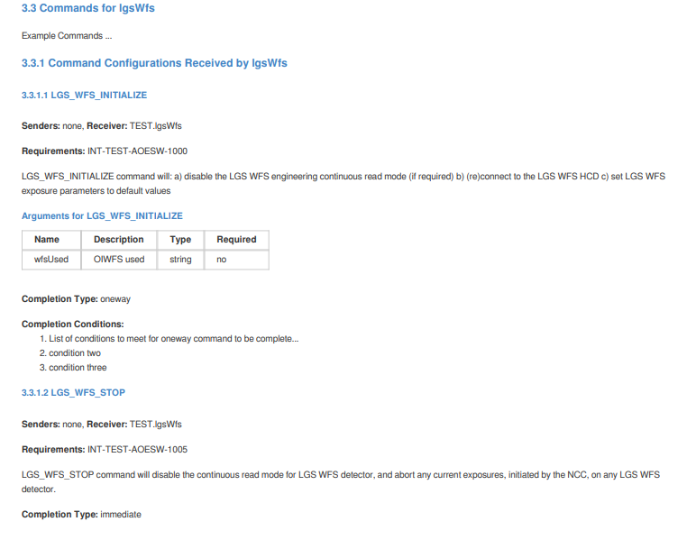

The `send` container documents the configuration commands one component sends to another. This allows mapping the command flow in the system and dependencies between components. The name of the configuration command, the component and the subsystem are enough to identify the destination of the configuration command.

The example `send` container section of the `command-model.conf` file for the `TCS Corrections` assembly is shown below. 

```
send = [
  //*******
  // cabinet-environment assembly
  {
    name = GLY_init
    subsystem = IRIS
    component = cabinet_environment_assembly
  }
  {
    name = GLY_test
    subsystem = IRIS
    component = cabinet_environment_assembly
  }
  {
    name = TEMP_init
    subsystem = IRIS
    component = cabinet_environment_assembly
  }
  {
    name = TEMP_test
    subsystem = IRIS
    component = cabinet_environment_assembly
```

The generated HTML output from the above send section of the `command-model.conf` file is shown below. The description and other details are taken from the `publish` information in the database.

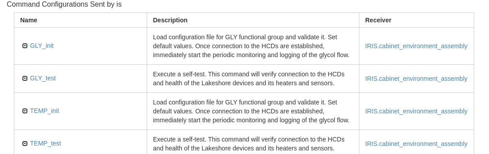

@@@ note

By default, sent commands are not displayed in API documents. To include them, pass the `–clientApi` option to `icd-db`, or select the `Include client API information` check box in the web app.

@@@

