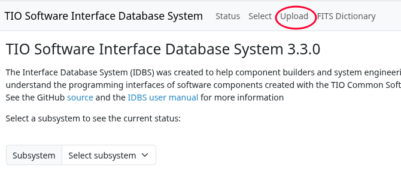
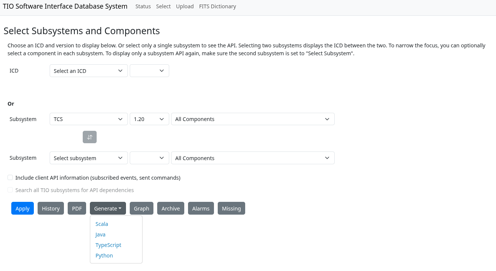
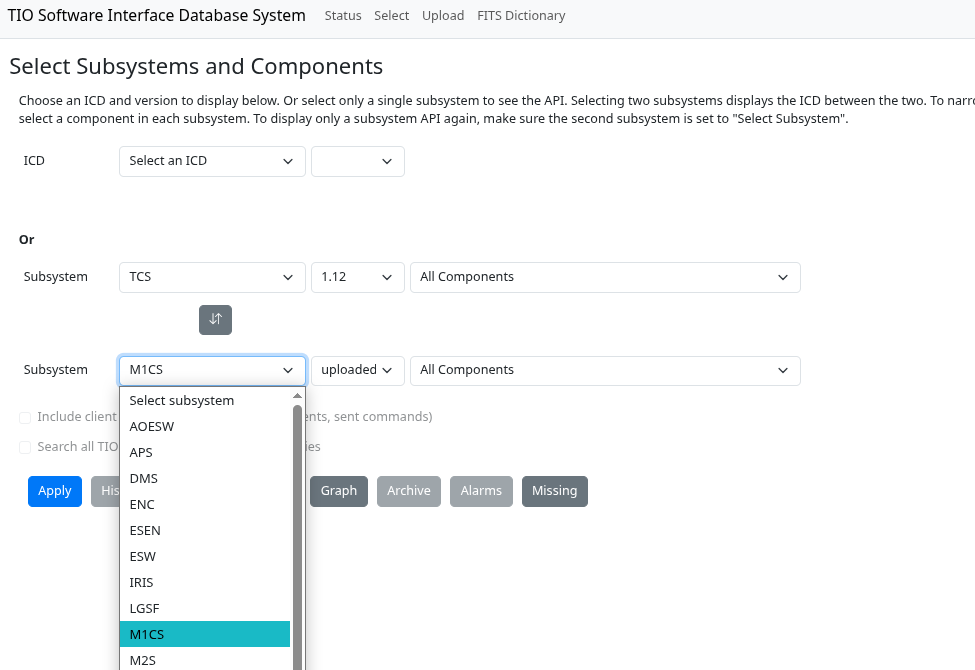
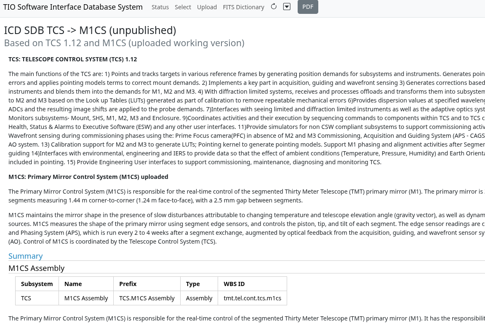

# Using the Web Interface

This section describes the web interface for IDBS. The idea is to show each of the possible steps.

The browser-based user interface allows ingesting model files and displaying versioned “API”s for each component. An API is defined as all the public functionality of a component and subsystem including inputs and outputs. An ICD is produced by taking the intersection of two published subsystem API documents. ICDs are then also published as versioned documents that depend on published subsystem API versions.  The publishing of APIs and ICDs is a role of Systems Engineering and is therefore password protected.  It can be performed using the icd web app (requires special command line option to icdwebserver). The web interface can be used to produce draft ICD and API documents that can be shared prior to the official publishing by Systems Engineering.

## Starting the icd web app

To start the icd web app, run:

    icdwebserver

By default, this starts the web app on port 9000 on localhost (http://localhost:9000). You can override this with options. For example:

    icdwebserver -Dhttp.port=9898 -Dhttp.host=192.168.178.77

## Upload Files

Installing the web app and uploading through the web app is not a bad way to check the content of model files because it also allows checking to see if the links are entered correctly. `icd-db` will only check that the files are syntactically correct.

Uploading with the browser works best with recent browser versions that support uploading a directory including all files in the directory. By using this feature, you can upload an entire subsystem of model files in one click. If your browser does not support uploading directories, try using Chrome.

If the web server is running on your own machine, go to http://localhost:9000. The empty website is shown in the following figure. The upload button is shown circled in red (the red circle does not appear in the UI!)

@@@ note

The icd web app automatically ingests any released APIs and ICDs on startup by downloading any missing versions from the GitHub repos under https://github.com/tmt-icd. Then you can upload any directories containing model files that you are working on. These will be the considered the “working version” or “*” in the subsystem version menu.

@@@

## Procedure for Uploading Files

1. Select the upload button in the web app. The following figure shows the web page after selecting the upload button:

2. Select the `Choose Files` button and navigate to the directory of your model files. It can be a directory holding a single component or a directory containing other directories where each contained directory includes one component as shown in the following figure. The parent directory should be imported at least once to get the `subsystem-model.conf` file, which is a sibling of the component directories.

3. Selecting the directory will cause the web service to upload all the contained files and import them into the model file database.
The program shows progress and the status area shows any problems. The following figure shows the result of uploading the APS-Model-Files directory. It shows a progress bar in blue at 100%. Files other than icd model files are ignored and a warning is displayed (in case the file name was misspelled).

4. That's all for uploading. This can be done over and over and nothing is permanent until the API is published.

## View a Subsystem API

The next example shows how to view a subsystem API.

1. With the subsystem uploaded, its API can be viewed in the browser by selecting the subsystem in the subsystem pull-down menu at the top of the screen. The menu  shows all the subsystems found in the local database.

2. The browser content area will redraw with the contents of the selected subsystem. The result of selecting APS is shown in the following figure.

A couple of things to note: The area to the left shows a number of links. This area has one link for each component in the subsystem.

The content area displays all the components for the subsystem.  Clicking on one of the component links jumps to the given component’s information.

The displayed API is constructed from the current versions of the models in the database, and is therefore considered an unpublished working version.  Although APIs are published by Systems Engineering, the system allows the viewing of all versions of published APIs as well as the working version as shown above (Note: the published versions of the APIs are ingested directly from the GitHub repository, whereas the unpublished models are obtained only from the local database).  To do this, select the desired version number in the dropdown menu next to the subsystem name.

Note that “master” also appears in the list of versions and is linked to the contents of the master branch of a subsystem on GitHub. The contents of the master branch are automatically uploaded to the icd database (if there was a change) whenever you refresh the web app or when running the command: `icd-git --ingestMissing`.

There are two checkboxes in the Select dialog that are only enabled for APIs (when only one subsystem is selected).

* Include client API information (subscribed events, sent commands)
* Search all TMT subsystems for API dependencies

Selecting the first checkbox will include sections for subscribed events and sent commands in the API document, as well as columns for subscribers of published events and senders of received commands. By default, these are not displayed in API documents.

Selecting the second checkbox will enable searching the entire database for subscribers of published commands and senders of received commands. By default, only the selected subsystem is searched for this information. 

## Check for Missing Items

A recent addition to the icd web app is the Missing button that generates a PDF report displaying subscribed events that have no known publisher, or sent commands that are not defined anywhere or component names that refer to nonexisting components.

The Missing report is based on the selected subsystem or subsystems. If no subsystem is selected, it reports on all subsystems. If two subsystems are selected (an ICD), the report only lists the missing items  directly related to the two subsystems. If you select a single subsystem, the report will list all references that it makes to undefined items (commands, events, components).

It is a good ideas to view this report before publishing a subsystem API to find invalid references.

## Generate Source Code from the ICD Database

The Generate button lists the languages for which you can generate source code from the ICD database: Scala, Java, Python and TypeScript.

First select a subsystem and, optionally, a version and component. Then select Generate → Scala, for example. The generated source code containing event and command names and keys for the selected subsystem and component(s) is downloaded automatically to a file named *Subsystem*Api.scala in your Downloads directory: For example: TcsApi.scala. The keys can be found in nested objects (namespaces or static classes) starting with the top level object.

## View API History

The history of every published API can also be viewed, including an entry for every time the API is published. Selecting two different version checkboxes enables the Compare button, which shows the changes made between the versions in a JSON based format. Note that you can also compare versions of released APIs on GitHub under https://github.com/tmt-icd, since a version tag is added for each published version. There are also tools for comparing PDF files, which might be useful.

To view the API history, select a subsystem, and press the History button. The content area changes as shown in the following:

## Create and View an ICD

An ICD is formed by taking the intersection of the APIs of two TMT subsystems. That means in order to create an ICD there must be at least two subsystems in the database. The TCS API is created from various subsystem to TCS ICDs that exist and the TCS CODR SDD. The definitive TCS API will be a product of the TCS work packages.

It is possible to view ICDs with working/unpublished versions, with one unpublished version and one published version, or two published versions. ICDs can only be published between two published APIs.

This example will show how to view a working ICD between the published version 1.12 of the TCS API and the unpublished M1CS subsystem API.

1. Upload all the working versions of the APIs needed to form an ICD.

2. First select the version of the subsystem for the ICD. In the figure below the menu to the right of the subsystem shows the available versions. Version 1.12, the version published previously is selected. (To get back to the working version, select the asterisk in the menu.) Note that the content area says API for TCS 1.12 rather than the unpublished label.

3. Next, select a second subsystem in the second subsystem menu as shown in the figure to below the Subsystem menu. The figure shows the available subsystems (some may be only local and others automatically ingested from the ICD GitHub repositories). TCS is also selectable since one subsystem component can have an ICD with another in the same subsystem. Selecting M1CS shows the following screenshot (without the red arrow). To get out of ICD mode and back to browsing APIs, select the top item (Select Subsystem) in the second subsystem menu on the Select tab.

Note that the title shows ICD from TCS to M1CS (unpublished). This means that the displayed ICD is not published by Systems Engineering — it is a draft version.

Also note the circle on the screenshot below. The section “Events published by GLC” shows items published by the GLC component. The Subscriber column is a link to the component that subscribes to the event stream. The link can be selected to jump to the subscribing component, regardless of which of the two subsystems it is in.

The same is true for commands: There are links to the command senders for received commands.

The ability to see and display these links is one of the highest priority features for this project. This is one feature that is not possible with simpler documentation tools.

## View ICD History

Like an API, it’s possible to view the history of an ICD between two subsystems.

1. With a published ICD is selected, select the History button as was done in the about viewing an API history. The following screenshot shows the history for the IRIS to TCS ICD. The versions of the APIs are shown as well as the ICD version.

## Print an ICD or API

The last supported feature is to print an API document or save it as a PDF for inclusion as a review deliverable. Ideally, we will just provide a link to the IDBS that reproduces the referenced ICD, but the PDF option in the toolbar allows outputting a PDF version with a table of contents and front page. The figure below shows a portion of the PDF output for our TCS to M1CS ICD Version 1.1.

## View a Graph of Component Relationships

The Graph button in the Select tab displays a dialog for creating a graph of component and subsystem relationships. The graph is based on the selected subsystems and components, which we call the primary components. These are displayed as solid ovals. All the components that the primary components talk (via events or commands) to are then included as dashed ovals. The edges of the graph indicate the flow of events and commands between the components. References to events or commands that were never defined are displayed in red, as are components that do not exist.

The figure below shows the Select dialog with the Graph toolbar button and the IRIS.oiwfs.poa component selected:

Pressing the Graph button opens a dialog with options for the graph:

Note that the graph is created using the GraphViz Dot language. See https://graphviz.org/ for an explanation of layouts and overlap handling. You can also use the `icd-viz` command line application to produce the same graph. The command line version lets you choose more than two primary components and save the Dot file.

Pressing Apply in the Graph dialog creates this graph for the selected IRIS component:

The default colors used for the graph can be found in the `icd-viz` `reference.conf` file and can also be overridden with a command line option like `-Dicd.viz.color.IRIS=darkgreen` (Replace IRIS with the subsystem and the color with a valid Graphviz color). A future version of the icd web app may include a tab in the graph options dialog for configuring the colors.

Here is a legend for the generated graph:

In the above graph, you can see that `oiwfs.poa` is the primary component (represented as a solid oval). It publishes events to other components, such as `IRIS.oiwfs.detector` and `AOESW.aosq` and subscribes to events from `NFIRAOS.rtc` and `TCS.cmIRIS`. `AOESW.aosq` also sends commands to `oiwfs.poa`, however the command names are not listed, since that option was not selected in the graph dialog. The red question mark in IRIS indicates that `oiwfs.poa` publishes events that have no known subscribers. The other red arrows indicate that it also subscribes to some events that are not published anywhere (perhaps an error). Displaying these errors is optional. The figure below shows the same graph with the missing events option turned off and command labels turned on.

