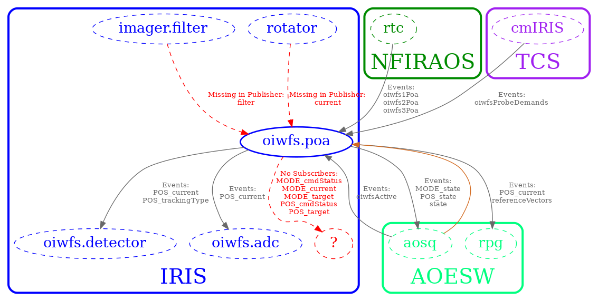

ICD Database
============

This project provides the ICD database interface and two command line applications, based on MongoDB.
It is assumed that the MongoDB server is running on the given (or default) host and port.

To start the MongoDB server, you can run a command like this:

    mongod -dbpath $db
    
where $db is the directory thath contains (or should contain) the database.
See [here](https://docs.mongodb.com/manual/administration/install-community/) for more information about installing
and running MongoDB.

The database name used to store API information is configured in src/main/resources/reference.conf
(The test cases use a different database).

icd-db Command
--------------

The icd-db command is generated in target/universal/stage/bin (install.sh copies it to the install/bin directory).

Example files that can be ingested into the database for testing can be found
in the [examples/3.0](../examples/3.0) directory.

```
icd-db 3.2.0
Usage: icd-db [options]

  --db <name>              The name of the database to use (default: icds4)
  -h, --host <hostname>    The host name where the database is running (default: localhost)
  -p, --port <number>      The port number to use for the database (default: 27017)
  -i, --ingest <dir>       Top level directory containing files to ingest into the database
  -l, --list [subsystems|assemblies|hcds|all]
                           Prints a list of ICD subsystems, assemblies, HCDs or all components
  --listData <subsystem>   Prints a list of event sizes and yearly accumulation of archived data for components of the specified subsystem.
  -u, --allUnits           Prints the set of unique units used in all received commands and published events for all components in DB.
  -c, --component <name>   Specifies the component to be used by any following options (subsystem must also be specified)
  -s, --subsystem <subsystem>[:version]
                           Specifies the subsystem (and optional version) to be used by any following options
  -t, --subsystem2 <subsystem>[:version]
                           Specifies the second subsystem (and optional version) in an ICD to be used by any following options
  --component2 <name>      Specifies the subsystem2 component to be used by any following options (subsystem2 must also be specified)
  --icdversion <icd-version>
                           Specifies the version to be used by any following options (overrides subsystem and subsystem2 versions)
  -o, --out <outputFile>   Saves the selected API (or ICD) to the given file in a format based on the file's suffix (html, pdf) or generates code for the given API in a language based on the suffix ('scala', 'java', 'ts' (typescript), py (python))
  --drop [db|subsystem|component]
                           Drops the specified component, subsystem, or the entire icd database (requires restart of icd web app)
  --versions <subsystem>   List the version history of the given subsystem
  --diff <subsystem>:<version1>[,version2]
                           For the given subsystem, list the differences between <version1> and <version2> (or the current version)
  -m, --missing <outputFile>
                           Generates a 'Missing Items' report to the given file (dir for csv) in a format based on the file's suffix (html, pdf, otherwise text/csv formatted files are generated in given dir)
  -a, --archived <outputFile>
                           Generates an 'Archived Items' report for all subsystems (or the given one) to the given file in a format based on the file's suffix (html, pdf, csv)
  --alarms <outputFile>    Generates an 'Alarms' report for all subsystems (or the given one) to the given file in a format based on the file's suffix (html, pdf, csv)
  --allSubsystems          Include all subsystems in searches for publishers, subscribers, etc. while generating API doc (Default: only consider the one subsystem)
  --clientApi              Include subscribed events and sent commands in the API dic (Default: only include published events and received commands)
  --orientation [portrait|landscape]
                           For PDF output: The page orientation (default: landscape)
  --fontSize <size>        For PDF or HTML file output: The base font size in px for body text (default: 10)
  --lineHeight <height>    For PDF or HTML file output: The line height (default: 1.6)
  --paperSize [Letter|Legal|A4|A3]
                           For PDF output: The paper size (default: Letter)
  --documentNumber text    For PDF output: An optional document number to display after the title/subtitle
  --package package.name   Package name for generated Scala files (default: no package)
  --help
  --version
```

Example:
--------

```
> icd-db --ingest examples/NFIRAOS/
> icd-db --list all
  NFIRAOS
  env.ctrl
  lgsWfs
  nacqNhrwfs
  ndme
> icd-db --list assemblies
  env.ctrl
  lgsWfs
  nacqNhrwfs
  ndme
> icd-db --subsystem NFIRAOS -o NFIRAOS.pdf

```

You can also generate code based on the contents of the icd database.
For example:

```
icd-db -s TCS --package tcs.api -o TcsApi.scala
icd-db -s TCS -c MCSAssembly --package tcs.mcsAssembly.api -o TcsMcsAssemblyApi.scala
```

The generated Scala file contains definitions for all of the event, command and parameter keys.
The first command generates keys for all TCS components. The second one only for the MCS Assembly.


icd-git command
---------------

icd-git is a command line application that reads model files from the GitHub
[ICD-Model-Files](https://github.com/tmt-icd/ICD-Model-Files.git) repositories and
ingests them into the icd database.

*Note: The icd web app automatically ingests the latest published versions of APIs and ICDs on startup
and will load any older versions of subsystem APIs on demand. 
The icd-git command line app lets you do this manually from the command line.*

*The code for publishing APIs and ICDs is contained in this subproject, however actual
publishing is done via the icd web app by a TMT admin.*

In order for a subsystem to be part of an ICD, the API for it first needs to be published.
Publishing a subsystem API or ICD creates an entry in a JSON file in the
[ICD-Model-Files](https://github.com/tmt-icd/ICD-Model-Files.git)/apis or
[ICD-Model-Files](https://github.com/tmt-icd/ICD-Model-Files.git)/icds directory.
These files should not be manually edited. They are used to store version related information.

An ICD version is defined by an entry in a JSON formatted file named `icd-$subsytem1-$subsystem2.json`
which is stored in the icds subdirectory of the repository.
The file lists the two subsystems that make up the ICD, the ICD version, the versions of the two subsystems along with the
user name of the user that created the version, a comment and the date.

The version files for the subsystem APIs also contain the git commit ids that correspond to that version.
These are used to ingest the version history into the ICD database.

Subsystem Order
---------------

Note that since the ICD from A to B is equivalent to the one from B to A, the convention is
that the subsystems are listed in a certain order. This is enforced internally by the
icd-git application.
The order of subsystems is the same as in the [subsystem.conf](../icd-db/src/main/resources/3.0/subsystem.conf)) file.

Usage:
------

In most cases you need to specify one or two subsystems using the --subsystems option
(Subsystems are separated by commas, with no spaces).
For example:

    --subsystems TEST,TEST2

Where it makes sense, such as when *publishing* ICDs, you can add the subsystem versions after a colon ":". For example:

    --subsystems TEST:1.2,TEST2:1.0

Add the `-i` or `--interactive` option to enter the required options interactively, choosing from
a list of possible subsystems and versions.

```
icd-git 3.2.0
Usage: icd-git [options]

  -l, --list               Prints the list of API or ICD versions defined on GitHub for the given subsystem options
  -s, --subsystems <subsystem1>[:version1],...
                           Specifies the subsystems (and optional versions) of the APIs to be used by the other options
  --icdversion <icd-version>
                           Specifies the ICD version for the --unpublish option
  -i, --interactive        Interactive mode: Asks to choose missing options
  --publish                Publish an API (one subsystem) or ICD (two subsystems) based on the options (--subsystems, --user, --password, --comment)
  --unpublish              Deletes the entry for the given API or ICD version (Use together with --subsystems, --icdversion)
  --major                  Use with --publish to increment the major version
  -u, --user <user>        Use with --publish or --unpublish to set the GitHub user name (default: $USER)
  -p, --password <password>
                           Use with --publish or --unpublish to set the user's GitHub password
  -m, --comment <text>     Use with --publish to add a comment describing the changes made
  -d, --db <name>          The name of the database to use (for the --ingest option, default: icds4)
  --host <hostname>        The host name where the database is running (for the --ingest option, default: localhost)
  --port <number>          The port number to use for the database (for the --ingest option, default: 27017)
  --ingest                 Ingests the selected subsystem model files and ICDs from GitHub into the ICD database (Ingests the latest published subsystems, if no subsystem options given)
  --ingestAll              Ingests all subsystem APIs and ICDs plus any master branch versions of APIs on GitHub into the local icd database
  --help
  --version
```

Note that the `--publish` and `--unpublish` options require permissions and are not normally used directly.
Instead, the icd web app is used by a TMT admin to publish APIs and ICDs.

Additional Configuration Options for Testing
--------------------------------------------

For testing, you may want to use a repository other than the default (https://github.com/tmt-icd).
There are two system properties (Java -D options) that you can use to override the default Git repository:

* -Dcsw.services.icd.github.parent.uri=https://github.com/*yourRepo*

This overrides the base URI used for the subsystem Git repositories (The default value is https://github.com/tmt-icd).

* -Dcsw.services.icd.github.uri=https://github.com/*yourRepo*

This overrides only the base URI containing ICD-Model-Files repository, which contains version information stored in JSON files in
the apis and icds subdirectories (The default value is valueOf("csw.services.icd.github.parent.uri")/ICD-Model-Files).
You could override this URI in order to test making releases without actually publishing them on the official Git repository.

Note that these options / system properties will work for both the icd-git and icdwebserver applications.

Example Command Line Usage
--------------------------

List the ICD versions between the subsystems TEST and TEST2, in interactive mode:

```
$ icd-git -i --list
Please enter the first subsystem: (one of M2S, ROAD, OSS, TINC, SCMS, CSW, ESEN, SUM, REFR, NFIRAOS, LGSF, AOESW, TEST, STR, TEST2, HQ, APS, M1CS, IRMS, HNDL, ENC, M3S, WFOS, COOL, CRYO, COAT, ESW, SOSS, DPS, MCS, M1S, CLN, TCS, NSCU, DMS, TINS, IRIS, CIS)
TEST
Please enter the second subsystem: (one of M2S, ROAD, OSS, TINC, SCMS, CSW, ESEN, SUM, REFR, NFIRAOS, LGSF, AOESW, TEST, STR, TEST2, HQ, APS, M1CS, IRMS, HNDL, ENC, M3S, WFOS, COOL, CRYO, COAT, ESW, SOSS, DPS, MCS, M1S, CLN, TCS, NSCU, DMS, TINS, IRIS, CIS)
TEST2

- ICD Version 1.0 between TEST-1.0 and TEST2-1.0: published by abrighton on 2016-08-17T23:38:39.098+02:00: Some comment

```

Without the -i option, you need to specify all the required options:

```
$ icd-git --list --subsystems TEST,TEST2
```

For publishing (*not used*), you need to also add your GitHub user name and password:

```
$ icd-git -i --publish
Please enter the first subsystem: (one of M2S, ROAD, OSS, TINC, SCMS, CSW, ESEN, SUM, REFR, NFIRAOS, LGSF, AOESW, TEST, STR, TEST2, HQ, APS, M1CS, IRMS, HNDL, ENC, M3S, WFOS, COOL, CRYO, COAT, ESW, SOSS, DPS, MCS, M1S, CLN, TCS, NSCU, DMS, TINS, IRIS, CIS)
TEST
Please enter the version for TEST: (one of List(1.0, 1.1, 1.2))
1.1
Please enter the second subsystem: (one of M2S, ROAD, OSS, TINC, SCMS, CSW, ESEN, SUM, REFR, NFIRAOS, LGSF, AOESW, TEST, STR, TEST2, HQ, APS, M1CS, IRMS, HNDL, ENC, M3S, WFOS, COOL, CRYO, COAT, ESW, SOSS, DPS, MCS, M1S, CLN, TCS, NSCU, DMS, TINS, IRIS, CIS)
TEST2
Enter the user name for Git: [$USER]

Enter the password for Git:

Enter a comment for the new ICD version:
This is a test comment
Created ICD version 1.1 based on TEST-1.1 and TEST2-1.0
```

Without the -i option, you need to specify all the required options:

```
$ icd-git --publish --subsystems TEST:1.2,TEST2:1.0 --user $USER --password XXXXX --comment "Another update"
Created ICD version 1.2 based on TEST-1.2 and TEST2-1.0
```

To ingest an ICD for two subsystems into the local ICD database, use a command like this:

    $ icd-git --ingest --subsystems TEST,TEST2

This deletes the current ICD database,
loads the ICD model files (with version history) for the TEST and TEST2 subsystems into the ICD database,
reads the ICD version information from GitHub and updates the database. After running this command,
you can use the icd web app to browse the ICD or use the `icd-db` command line app to generate a pdf
of the ICD.

If you leave off the `--subsystems` option, all subsystems and ICDs are ingested into the database:

    $ icd-git --ingest --subsystems TEST,TEST2

It is also possible to ingest only specific versions of subsystems:

    $ icd-git --ingest --subsystems TEST:1.2,TEST2:1.1

In that case, only ICDs that include those subsystem versions will be defined.

icd-fits Command
--------------

The icd-fits command supports working with the FITS Dictionary:

```
icd-fits 3.2.0
Usage: icd-fits [options]

  -d, --db <name>          The name of the database to use (for the --ingest option, default: icds4)
  --host <hostname>        The host name where the database is running (for the --ingest option, default: localhost)
  --port <number>          The port number to use for the database (for the --ingest option, default: 27017)
  -c, --component <name>   Specifies the component to be used by any following options (subsystem must also be specified)
  -s, --subsystem <subsystem>[:version]
                           Specifies the subsystem (and optional version) to be used by any following options
  -t, --tag <tag>          Filters the list of FITS keywords to those with the given tag
  -l, --list               Prints the list of known FITS keywords
  --validate <file>        Validates a JSON formatted file containing the FITS Keyword dictionary and prints out any errors
  -g, --generate <file>    Generates an updated FITS dictionary JSON file by merging the one currently in the icd database with the FITS keyword information defined for event parameters in the publish model files. If a subsystem is specified (with optional version), the merging is limited to that subsystem.
  -i, --ingest <file>      Ingest a JSON formatted file containing a FITS Keyword dictionary into the icd database
  --ingestTags <file>      Ingest a JSON or HOCON formatted file defining tags for the FITS dictionary into the icd database
  --ingestChannels <file>  Ingest a JSON or HOCON formatted file defining the available FITS channels for each subsystem into the icd database
  -o, --out <outputFile>   Generates a document containing a table of FITS keyword information in a format based on the file's suffix (html, pdf, json, csv, conf (HOCON))
  --orientation [portrait|landscape]
                           For PDF output: The page orientation (default: landscape)
  --fontSize <size>        For PDF or HTML file output: The base font size in px for body text (default: 10)
  --lineHeight <height>    For PDF or HTML file output: The line height (default: 1.6)
  --paperSize [Letter|Legal|A4|A3]
                           For PDF output: The paper size (default: Letter)
  --help
  --version
```

The icd-viz command
-------------------

icd-viz is a command line app that uses Graphviz/Dot to generate graphs of subsystem component relationships based on command line arguments.

__Note__: The [Graphviz](https://graphviz.org/download/) apps needs to be installed on the local machine in order to use this application.

This app is based on previous [work in Python](https://raw.githubusercontent.com/tmtsoftware/NIC/master/script/icdRelationships.py) by Ed Chapin.

See also the [Graphviz](https://graphviz.org/doc/info/attrs.html) documentation for an explanation of options, such as *layout* or *overlap*.

## Usage

```
icd-viz 3.2.0
Usage: icd-viz [options]

  -d, --db <name>          The name of the database to use (default: icds4)
  -h, --host <hostname>    The host name where the database is running (default: localhost)
  -p, --port <number>      The port number to use for the database (default: 27017)
  --components prefix1[:version],prefix2[:version],...
                           Comma-separated list of primary component prefixes with optional versions (:version)
  --subsystems subsystem1[:version],subsystem2[:version],...
                           Comma-separated list of primary subsystems with optional versions (:version)
  --showplot <value>       Display plot in a window (default=true)
  -o, --imagefile <file>   Write image to file in format based on file suffix (default=None, formats: PDF, PNG, SVG, EPS)
  --dotfile <file>         Write dot source to file (default=None)
  --ratio <ratio>          Image aspect ratio (y/x) (default=0.5)
  --missingevents <value>  Plot missing events (default=true)
  --missingcommands <value>
                           Plot missing commands (default=false)
  --commandlabels <value>  Plot command labels (default=false)
  --eventlabels <value>    Plot event labels (default=true)
  --groupsubsystems <value>
                           Group components from same subsystem together (default=true)
  --onlysubsystems <value>
                           Only display subsystems, not components (implies --groupsubsystems false, default=false)
  --layout one of: dot, fdp, sfdp, twopi, neato, circo, patchwork
                           Dot layout engine (default=dot)
  --overlap one of true, false, scale
                           Node overlap handling (default=scale)
  --splines <value>        Use splines for edges? (default=true)
  --omittypes <value>      Comma-separated list of component types (None, HCD, Assembly, Sequencer, Application) to omit as primaries (default='None')
  --imageformat <value>    Image format (Used only if imageFile not given or has invalid suffix). One of {PDF, PNG, SVG, EPS} (default='PDF')
  --help
  --version
```

All components specified through the `--components` or `--subsystems` arguments are considered *primary* nodes and indicated with solid ovals.
Any other component that they communicate with is a *secondary* node, and will be shown with a dashed oval.

The default colors used for the graph can be found in [reference.conf](src/main/resources/reference.conf) and can also be overridden with a command line option like `-Dicd.viz.color.IRIS=darkgreen` (replace IRIS with the subsystem):

* __commands__ - chocolate
* __events__ - dimgrey
* *missing commands or events* - red

__Subsystems__:
- NFIRAOS - green4
- AOESW - springgreen
- TCS - purple
- IRIS - blue
- APS - darkgreen
- OSS - darkred
- ESW - darkslategray
- *others* - grey

Examples:

* Plot all interfaces for a particular component to the screen,
  label events and commands, and show missing events and commands

```
icd-viz --components iris.oiwfs.poa --missingcommands true --missingevents true --commandlabels true --eventlabels true
```



* Plot all interfaces for two components only to a file called graph.pdf

```
icd-viz --components iris.oiwfs.poa,iris.rotator --imagefile graph.pdf
```

* Plot all interfaces for multiple subsystems and one component from another subsystem to screen, with no missing events shown

```
icd-viz --components iris.rotator --subsystems nfiraos,tcs --missingevents false
```

* Use "neato" layout to get a more readable graph with a lot of nodes

```
icd-viz --subsystems iris --layout neato --eventlabels false --overlap false

```


Implementation
--------------

Each model file is stored in its own MongoDB collection.
Here is a listing of the collections present after running this ingest command:


```
> icd-db --ingest examples/NFIRAOS/
> mongo icds4
MongoDB shell version v3.6.8
connecting to: mongodb://127.0.0.1:27017/icds4
> show collections
AOESW.aosq.command
AOESW.aosq.command.v
AOESW.aosq.component
AOESW.aosq.component.v
AOESW.aosq.publish
AOESW.aosq.publish.v
AOESW.aosq.subscribe
AOESW.aosq.subscribe.v
AOESW.aosq.v
AOESW.psfr.command
AOESW.psfr.command.v
...
```

The code then looks for collections with names ending in .subsystem, .component, .publish, .subscribe, .command, or .service.
Queries can be run on all collections.

# API versions

The collection names without ".v" above are for the *current, unpublished versions" of the model files.
This is where the data is stored after ingesting the files into the database.

When ingesting API releases that were published on GitHub (using icd-git), the different versions of the
model files are *published* locally in the MongoDB and stored in collections that end with ".v".
