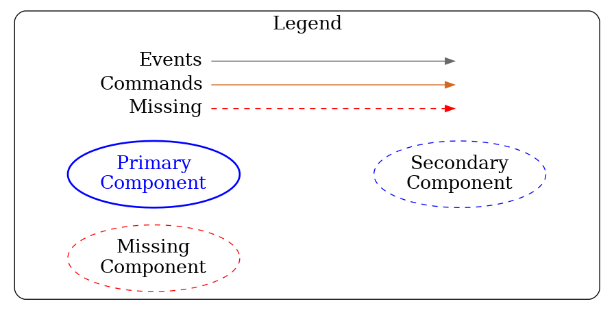

icd-viz
=======

A command line app that uses Graphviz/Dot to generate graphs of subsystem component relationships based on command line arguments.

__Note__: The [Graphviz](https://graphviz.org/download/) apps needs to be installed on the local machine in order to use this application. 

This app is based on previous [work in Python](https://raw.githubusercontent.com/tmtsoftware/NIC/master/script/icdRelationships.py) by Ed Chapin. 

See also the [Graphviz](https://graphviz.org/doc/info/attrs.html) documentation for an explanation of options, such as *layout* or *overlap*. 

## Usage

```
icd-viz 2.0.0
Usage: icd-viz [options]

  -d, --db <name>          The name of the database to use (default: icds4)
  -h, --host <hostname>    The host name where the database is running (default: localhost)
  -p, --port <number>      The port number to use for the database (default: 27017)
  --components prefix1[:version],prefix2[:version],...
                           Comma-separated list of primary component prefixes with optional versions (:version)
  --subsystems subsystem1[:version],subsystem2[:version],...
                           Comma-separated list of primary subsystems with optional versions (:version)
  --showplot <value>       Display plot in a window (default=true)
  -o, --imagefile <file>   Write image to file in format based on file suffix (default=None, formats: PDF, PNG, SVG, EPS)
  --dotfile <file>         Write dot source to file (default=None)
  --ratio <ratio>          Image aspect ratio (y/x) (default=0.5)
  --missingevents <value>  Plot missing events (default=true)
  --missingcommands <value>
                           Plot missing commands (default=false)
  --commandlabels <value>  Plot command labels (default=false)
  --eventlabels <value>    Plot event labels (default=true)
  --groupsubsystems <value>
                           Group components from same subsystem together (default=true)
  --layout one of: dot, fdp, sfdp, twopi, neato, circo, patchwork
                           Dot layout engine (default=dot)
  --overlap one of true, false, scale
                           Node overlap handling (default=scale)
  --splines <value>        Use splines for edges? (default=true)
  --omittypes <value>      Comma-separated list of component types (None, HCD, Assembly, Sequencer, Application) to omit as primaries (default='None')
  --imageformat <value>    Image format (Used only if imageFile not given or has invalid suffix). One of {PDF, PNG, SVG, EPS} (default='PDF')
  --help                   
  --version                
```

All components specified through the `--components` or `--subsystems` arguments are considered *primary* nodes and indicated with solid ovals. 
Any other component that they communicate with is a *secondary* node, and will be shown with a dashed oval.
        
The default colors used for the graph can be found in [reference.conf](src/main/resources/reference.conf) and can also be overridden with a command line option like `-Dicd.viz.color.IRIS=darkgreen` (replace IRIS with the subsystem):

* __commands__ - chocolate
* __events__ - dimgrey
* *missing commands or events* - red

__Subsystems__:
- NFIRAOS - green4
- AOESW - springgreen
- TCS - purple
- IRIS - blue
- APS - darkgreen
- OSS - darkred
- ESW - darkslategray
- *others* - grey
        
Examples:

* Plot all interfaces for a particular component to the screen,
label events and commands, and show missing events and commands

```
icd-viz --components iris.oiwfs.poa --missingcommands true --missingevents true --commandlabels true --eventlabels true
```


* Plot all interfaces for two components only to a file called graph.pdf

```
icd-viz --components iris.oiwfs.poa,iris.rotator --imagefile graph.pdf
```

* Plot all interfaces for multiple subsystems and one component from another subsystem to screen, with no missing events shown

```
icd-viz --components iris.rotator --subsystems nfiraos,tcs --missingevents false
```

* Use "neato" layout to get a more readable graph with a lot of nodes

```
icd-viz --subsystems iris --layout neato --eventlabels false --overlap false

```


